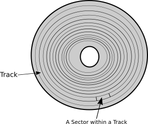

# Chapter 1: Let's Start with the Bootloader

## Introduction
The first piece to start with when writing an operating system's kernel is the *boot loader* which is the code that is responsible for loading the main kernel from the disk to the main memory so the kernel can be executed. Before getting started in the details of the boot loader and all other parts of the kernel, we need to learn a little bit about the tools (e.g. compilers and programming languages) that we will use in our journey of creating a kernel. In this chapter, we start with an overview on the tools and their basics and then we start in writing a boot loader.

## x86 Assembly Language Overview
To build a boot loader, we need to use assembly language, also, there are some parts of an operating system kernel that cannot be written in a high-level language and assembly language should be used instead as you will see later in this book, therefore, a basic knowledge of the target architecture assembly is required, in our case, the target architecture of our kernel is x86.

The program that takes a source code which is written in assembly language and transforms this code to the machine language is known as *assembler* [^4]. There are many assemblers available for x86 but the one that we are going to use is Netwide Assembler (NASM). However, the concepts of x86 assembly are the same, they are tight to the architecture itself, also the instructions are the same, so if you grasp the basics it will be easy to use any other assembler [^5] even if it uses other syntax than NASM. Don't forget that the assembler is just a tool that helps us to generate an executable x86 machine code out of an assembly code, so, any suitable assembler that we use to reach our goal will be enough.

In this section I don't aim to examine the details of x86 or NASM, you can consider this section as a quick start on both x86 and NASM, the basics will be presented to make you familiar with x86 assembly language, more advanced concepts will be presented later when we need them. If you are interested in x86 assembly for its own sake, there are multiple online resources and books that explain it in details.

### Registers
In any processor architecture, and x86 is not an exception, a register is a small memory inside the processor's chip. Like any other type of memories (e.g. RAM), we can store data inside a register and we can read data from it, the registers are too small and too fast. The processor architecture provides us with multiple registers. In x86 there are two types of registers: general purpose registers and special purpose registers. In general purpose registers we can store any kind of data we want, while the special purpose registers are provided by the architecture for some specific purposes, we will encounter the second type later in our journey of creating 539kernel.

x86 provides us with eight general purpose registers and to use them in order to read from or write to them we refer to them by their names in assembly code. The names of these registers are: `EAX`, `EBX`, `ECX`, `EDX`, `ESI`, `EDI`, `EBP`, and `ESP`. While the registers `ESI`, `EDI`, `EBP` and `ESP` are considered as general purpose registers in x86 architecture ^[According to Intel's manual.], we will see later that they store some important data in some cases and it's better to use them carefully if we are forced to.

The size of each one of x86's general purpose registers is `32` bits (`4` bytes) and due to that, they are available only on x86 processors that supports `32-bit` architecture [^6] such as Pentium 4 for instance. These `32-bit` registers are not available on x86 processors that support only `16-bit` architecture or lower, so, for example, you can't use the register `EAX` in Intel 8086 because it is a `16-bit` x86 processor and not `32-bit`.

In old days, when `16-bit` x86 processors were dominant, assembly programmers used the registers `AX`, `BX`, `CX` and `DX` and each one of them is of size `16` bits (`2` bytes), but when `32-bit` x86 processors came, these registers have been extended to have the size `32-bit` and their names were changed to `EAX`, `EBX`, `ECX` and `EDX`. The first letter `E` of the new names means *extended*. However, the old names are still usable in `32-bit` x86 processors and they are used to access and manipulate the first `16` bits of the corresponding register, for instance, to access the first `16` bits of the register `EAX`, the name `AX` can be used. Furthermore, the first `16` bits of these registers can be divided into two parts and each one of them is of size`8` bits (`1` bytes) and has its own name that can be referred to in the assembly code. The first `8` bits of the register are called the *low* bits, while the second `8` bits are called the *high* bits.

Let's take one of these register as an example:`AX` register is a `16-bit` register which is a part of the bigger `32-bit` `EAX` register in `32-bit` architecture. `AX` ^[Or in other words for `32-bit` architecture: The first `16` bits of `EAX`.] is divided into two more parts, `AL` for the **l**ow `8` bits as the second letter of the name indicates and `AH` for the **h**igh `8` bits as the second letter of the name indicates. The same division holds true for the registers `BX`, `CX` and `DX`, figure @fig:26012022_0 illustrates that division.

{#fig:26012022_0 width=35%}

### Instruction Set
The processor's architecture provides the programmer with a bunch of *instructions* that can be used in assembly code. Processor's instructions resemble functions [^7] in a high-level languages which are provided by the libraries, in our case, we can consider the processor as the ultimate library for the assembly code. As with functions in high-level programming languages, each instruction has a name and performs a specific job, also, it can take parameters which are called *operands*. Depending on the instruction itself, the operands can be a static value (e.g. a number), a register name that the instruction is going to fetch the stored value of it to be used or even a memory location. 

The assembly language is really simple. An assembly code is simply a sequence of instructions which will be executed sequentially. The following is an example of assembly code, don't worry about its functionality right now, you will understand what it does eventually.

```{.asm}
mov ah, 0Eh
mov al, 's'	
int 10h
```

As you can see, each line starts with an instruction which is provided to us by x86 architecture, in the first two lines we use an instruction named `mov` and as you can see, this instruction receives two operands which are separated by a comma. In the current usage of this instruction we can see that the first operand is a register name while the second operand is a static value. The third line uses another instruction named `int` which receives one operand. When this code is running, it will be executed by the processor sequentially, starting from the first line until it finishes in the last line.

If you are interested on the available instructions on x86, there is a four-volumes manual named "Intel® 64 and IA-32 architectures software developer's manual" provided by Intel that explains each instruction in details [^9].

#### Assigning Values with `mov`
You can imagine a register as a variable in high-level languages. We can assign values to a variable, we can change its old value and we can copy its value to another variable. In assembly language, these operations can be performed by the instruction `mov` which takes the value of the second operand and stores it in the first operand. You have seen in the previous examples the following two lines that use `mov` instruction.

```{.asm}
mov ah, 0Eh
mov al, 's'	
```

Now you can tell that the first line copies the value `0Eh` to the register `ah`, and the second line copies the character `s` to the register `al`. The single quotation is used in NASM to represent strings or characters and that's why we have used it in the second line, based on that, you may noticed that the value `0Eh` is not surrounded by a single quotation though it contains characters, in fact, this value isn't a string, it is a number that is represented by hexadecimal numbering system and due to that the character `h` was put in the end of that value, that is, putting `h` in the end of `0E` tells NASM that this value is a hexadecimal number, the equivalent number of `0E` in the decimal numbering system, which we humans are using, is `14`, that is `0E` and `14` are the exactly the same, but they are represented in two different numbering system^[Numbering systems will be discussed in more details later.].

### NASM
Netwide Assembler (NASM) is an open-source assembler for x86 architecture which uses Intel's syntax of assembly language, the other well-known syntax for assembly language is AT&T syntax and, of course, there are some differences between the two, the first syntax is used in the official manuals of Intel. NASM can be used through command line to assemble ^[The process of transforming an assembly source code to machine code is known as *assembling*.] x86 assembly code and generate the corresponding machine code. The basic usage of NASM command is the following.

```
nasm -f <format> <filename> [-o <output>]
```

The argument `format` decides the binary format of the generated machine code, the binary format will be discussed in more details in a moment. The second argument is the `filename` of the assembly file that we would like to assemble, and the last option and argument are optional, we use them if we want to specify a specific name for the generated binary file, the default name will be same as the filename with a different extension.

#### Binary Format
A *binary format* is basically a specification which gives a blueprint of how a binary file is organized, in other words, it describes how a binary file is structured, in general there are multiple parts in a binary file and a binary format can be used format them, the machine code is one part of a binary file parts. Note that each executable file uses some binary format to organize its content and to make a specific operating system understands its content. There is no difference between the programming languages in the matter of the binary format [^prog-lang-and-bin] that will be used in the last output of the compiling process, for example in Linux, if we create a software either by C, Rust or assembly, the last executable result will be a binary file that is formatted by using a binary format known as *Executable and Linkable Format* (ELF) which is the default in Linux. There are many other binary formats, Mach-O is one example which is used by Mach-based [^mach-microkernel], another example is Portable Executable (PE) which is used by Microsoft Windows.

Each operating system knows its own binary format well, and knows how a binary file that uses this format is structured, and how to seek the binary file to find the machine code that should be loaded into memory and executed by the processor. For example, when you run an ELF executable file in GNU/Linux system, the Linux kernel knows it is an ELF executable file and assumes that it is organized in a specific way, by using the specification of ELF, Linux kernel will be able to locate the machine code of the software inside the ELF file and load it into memory to be ready for execution.

In any binary format, one major part of the binary file that uses this format is the machine code that has been produced by compiling or assembling some source code, the machine code is specific to a processor architecture, for example, the machine code that has been generated for x64 [^x64] cannot run on x86. Because of that the binary files are distributed according to the processor architecture which can run on, for example, GNU/Linux users see the names of software packages in the following format `nasm_2.14-1_i386.deb`, the part `i386` tells the users that the binary machine code of this package is generated for `i386` architecture, which is another name for x86 by the way, that means this package cannot be used in a machine that uses ARM processor such as Raspberry Pi for example.

Due to that, to distribute a binary file of the same software for multiple processor's architectures, a separate binary file should be generated for each architecture, to solve this problem, a binary format named `FatELF` was presented. In this binary format, the software machine code of multiple processor architectures are gathered in one binary file and the suitable machine code will be loaded and run based on the type of the system's processor. Naturally, the size of the files that use such format will be bigger than the files that uses a binary format that is oriented for one processor architecture. Due to the bigger size, this type of binary formats is known as *fat binary*.

Getting back to the `format` argument of NASM, if our goal of using assembly language is to produce an executable file for Linux for example, we will use `elf` as a value for `format` argument. But we are working with low-level kernel development, so our binary files should be flat and the value of `format` should be `bin` to generate a *flat binary* file which doesn't use any specification, instead, in flat binary files, the output is stored as is with no additional information or organization, only the output machine language of our code. Using flat binary for bootloader does make sense and that's because the code which is going to load ^[Which is BIOS as we will see later.] our binary file doesn't understand any binary format to interpret it and fetch the machine code out of it, instead, the content of the binary file will be loaded to the memory as is.

## GNU Make
GNU Make is a build automation tool. Well, don't let this fancy term make you panic! the concept behind it is too simple. When we create a kernel of an operating system ^[Or any software with any other compiled programming languages.] we are going to write some assembly code and C code and both of them need to be assembled and compiled (for the C code) to generate the machine code as binary files out of them. With each time a modification is made in the source code, you need to recompile (or reassemble) the code over and over again through writing the same commands in the terminal in order to generate the last binary output of your code. Beside the compiling and recompiling steps, an important step needs to take place in order to generate the last output, this operation is known as *linking*, usually a programming project contains multiple source files that call each other, compiling each one of these files is going to generate a separate *object file* [^object_files] for each one, in linking process these different object files are linked with each other to generate one binary file out of these multiple object files, this last binary file represents the program that we are writing.

These operations which are needed to generate the last binary file out of the source code is known as *building process*, which, as mentioned earlier, involves executing multiple commands such as compiling, assembling and linking. The building process a tedious job and error-prone and to save our time (and ourselves from boredom of course) we don't want to write all these commands over and over again in order to generate the last output, we need an alternative and here where GNU Make ^[And any other building automation tool.] comes to the rescue, it *automates* the *building* process by gathering all required commands in a text file known as `Makefile` and once the user runs this file through the command `make`, GNU Make is going to run these commands sequentially, furthermore, it checks whether a code file is modified since the last building process or not, if the case is that the file is not modified then it will not be compiled again and the generated object file from the last building process is used instead, which of course minimize the needed time to finish the building process.

### Makefile
A `makefile` is a text file that tells GNU Make what are the needed steps to complete the building process of a specific source code. There is a specific syntax that we should obey when writing `makefile`. A number of *rules* may be defined, we can say that a `makefile` has a list of rules that define how to create the executable file. Each rule has the following format:

```{.makefile}
target: prerequisites
    recipe
```

When we run the command `make` without specifying a defined target name as an argument, GNU Make is going to start with the first rule in the `makefile` only if the first rule's target name doesn't start with dot, otherwise, the next rule will be considered. The name of a target can be a general name or filename. Assume that we defined a rule with the target name `foo` and it's not the first rule in `makefile`, we can tell GNU Make to execute this rule by running the command `make foo`. One of well-known convention when writing a `makefile` is to define a rule with target name `clean` that deletes all object files and binaries that have been created in the last building process. We will see after a short time the case where the name of a target is a filename instead of general name.

The `prerequisites` part of a rule is what we can call the list of dependencies, those dependencies can be either filenames (the C files of the source code for instance) or other rules in the same `makefile`. For GNU Make, to run the a specific rule successfully, the dependencies of this rule should be fulfilled, if there is another rule in the dependencies, it should be executed successfully first, if there is a filename in the dependencies list and there is no rule that has the same filename as a target name, then this file will be checked and used in the recipe of the rule.

Each line in the `recipe` part should start with a tab and it contains the commands that is going to run when the rule is being executed. These commands are normal Linux commands, so in this part of a rule we are going to write the compiling commands to compile the C source files, assembling commands for the assembly source files and linking command that links the generated object files. Any arbitrary command can be used in the recipe as we will see later when we create the `makefile` of 539kernel. Consider the following C source files, the first one is `file1.c`, the second one is `file2.h` and the third one is `file2.c`.

```{.c}
#include "file2.h"
int main()
{
	func();
}
```

```{.c}
void func();
```

```{.c}
#include <stdio.h>
void func()
{
	printf( "Hello World!" );
}
```

By using these three files, let's take an example of a `makefile` with filenames that have no rules with same target's name.

```{.makefile}
build: file1.c file2.c
	gcc -o ex_file file1.c file2.c
```

The target name of this rule is `build`, and since it is the first and only rule in the `makefile` which its name doesn't start with a dot, then it will be executed directly once the command `make` is issued, another way to execute this rule is by mentioning its name explicitly as an argument to `make` command as the following: `make build`.

The rule `build` depends on two C files, `file1.c` and `file2.c`, they should be available on the same directory. The the recipe uses GNU GCC to compile and link these two files and generate an executable file named `ex_file`. The following is an example of a `makefile` that has multiple rules.

```{.makefile}
build: file2.o file1.o
	gcc -o ex_file file1.o file2.o
file1.o: file1.c
	gcc -c file1.c
file2.o: file2.c file2.h
	gcc -c file2.c file2.h
```

In this example, the first rule `build` depends on two object files `file1.o` and `file2.o`. Before running the building process for the first time, these two files will not be available in the source code directory ^[Since they are a result of one step of the building process which is the compiling step that has not been performed yet.], therefore, we have defined a rule for each one of them. The rule `file1.o` is going to generate the object file `file1.o` and it depends on `file1.c`, the object file will be simple generated by compiling `file1.c`. The same happens with `file2.o` but this rule depends on two files instead of only one.

GNU Make also supports variables which can simply be defined as the following: `foo = bar` and they can be used in the rules as the following: `$(foo)`. Let's now redefine the second `makefile` by using the variables.

```{.makefile}
c_compiler = gcc
buid_dependencies = file1.o file2.o
file1_dependencies = file1.c
file2_dependencies = file2.c file2.h
bin_filename = ex_file
build: $(buid_dependencies)
	$(c_compiler) -o $(bin_filename) $(buid_dependencies)
file1.o: $(file1_dependencies)
	gcc -c $(file1_dependencies)
file2.o: $(file2_dependencies)
	gcc -c $(file2_dependencies)
```

## The Emulators
<!-- TODO -->

## Writing the Boot Loader
When a computer powers on, a piece of code named bootloader is loaded and takes the control of the computer. Usually, the goal of the bootloader is loading the kernel of an operating system from the disk to the main memory and gives the kernel the control over the computer. The firmware of a computer is the program which loads the bootloader, in IBM-compatible computers the name of this firmware is BIOS (Basic Input/Output System) ^[Before the advent of UEFI.].

There is a place in the hard disk called *boot sector*, it is the first sector of a hard disk ^[As we will see later, a magnetic hard disk has multiple stacked *platters*, each platter is divided into multiple *tracks* and inside each track there are multiple *sectors*.], BIOS loads the content of the boot sector as a first step of running the operating system. Loading the boot sector's content means that BIOS reads the content from hard disk and loads it into the main memory (RAM). This loaded content from the boot sector should be the bootloader, and once its loaded into the main memory, the processor will be able to execute it as any other code that we use in our computers. So, the last step performed by BIOS in booting process is giving the control to the bootloader to do whatever it wants.

Before getting started in writing 539kernel, we need to write the bootloader that is going to load 539kernel from the disk. In IBM-compatible PCs that uses BIOS to perform the booting process, the size of the bootloader is limited to `512` bytes and due to this limited size and the need of using low-level services, the bootloader is usually written in assembly language, also, because of this limited size, we cannot depend on BIOS to load 539kernel instead of the bootloader and that's because a kernel is usually bigger than `512` bytes, therefore, a small bootloader is loaded by BIOS in order to load the bigger piece of code which is the kernel. The reason of this limited size of the bootloader is because of the size of a sector in the hard disk itself. Each sector in the hard disk has the size of `512` bytes and as we have mentioned, BIOS is going to load the content of the first sector of hard disk, the boot sector, which, of course, as any other sector its size is `512` bytes. 

Beside the bootloader's limited size, it is going to run on an *x86 operating mode* known as *real mode* ^[The concept of x86 operating modes and the real mode will be discussed in more details later.], what we need to know about that for now is that real mode is a `16-bit` environment, so, even if the working processor is a `64-bit` processor, we can only use `16-bit` features of the processor, such as the registers of size `16` bits.

The booting process is too specific to the computer architecture as we have seen and it may differs between one architecture and another. Some readers, especially computer science students may notice that the academic textbooks of operating systems don't mention the bootloader or discuss it.

### Hard Disk Structure
A hard disk consists of multiple *platters* which are stacked together one above the other, have you ever seen a CD or a DVD? A platter has exactly the same shape, refer to Figure @fig:a-platter. The both surfaces (top and down) of a platter are covered by a magnetic layer which stores the data. For each surface of a platter there is a read/write head on it, and as you guessed, the role of this head is to read from a surface or write to it, a head is attached to an arm. Those arms move horizontally, back and forth, and because the other end of all of those arms are attached to the same physical part, they will be moved back and forth together to the same location at the same time. Figure @fig:platters-arms-heads shows how the platters, arms and read/write heads are assembled together.

{#fig:a-platter width=50%}

A surface of a platter is divided into a number of tracks and each track is divided into a number of sectors. In Figure @fig:tracks-sectors you can see how tracks and sectors are organized on a surface, the gray circles that have the same center (cocenteric) are the tracks, a track consists of a smaller parts which called sectors.  A sector is the smallest unit that holds data in hard disks and as you know from our previous discussion, the first sector in a hard disk is known as boot sector.

 {#fig:platters-arms-heads width=50%}

When a command is sent to the hard disk to write some data on it or read from it, at least two mechanical moves ^[This fancy term *mechanical moves* means that some physical parts of hard disk moves physically.] are performed. The first move is taken by the arms, they move back or forth in order to be upon the track that contains the data we would like to read, this operation is known as *seek* operation. So, *seek time* is the time needed to put a specific track under a read/write head. After finishing the seek operation, the read/write head will be on the right track but, also, it will be on a random sector ^[Not exactly random, can you tell why?], to reach the sector that we would like to read from (or write to) the platter rotates until the read/write head becomes upon the required sector. The speed of rotation is measured by a unit known as *revolutions per minute* (RPM) and the needed time to reach the required sector is known as *rotational latency*. Finally, the data will be *transferred* from the hard disk to the main memory, the time needed to transfer a number of bits known as *transfer time*.

Let's assume as an example a hard disk that has `3` platters, which means it has `6` surfaces, arms and read/write head. When the operating system request from the hard disk to seek a specific track, for instance track `3`, all `6` heads will seek the track `3` and when the seek operation ends, the `6` heads will point to the same physical position on all `6` surfaces, that is, the top head of the first platter and the bottom head of it will point to that same place, but the first one on the top while the second is on the bottom, and so on for the other `4` remaining heads, the collection of all these tracks that the heads point to at some point of time is called a *cylinder*.

{#fig:tracks-sectors width=50%}

Now, based on what we know about how a hard disk works, can we imagine what happens inside the hard disk when BIOS loads a bootloader? First, the arms will seek the track number `0` ^[I didn't mention that previously, but yes, the bootloader resides in track `0`.], that is, the arms move back or forth until they reach the track `0`, then the platter rotates until the read/write head become upon the sector `0`, finally, the content of sector `0` is transferred to the main memory.

### BIOS Services
We are in a journey of writing an operating system kernel, which means that we are dealing with a little bit harsh environment! Do you remember all libraries that we are lucky to have when developing normal software (user-space software), well, none of them are available right now! And they will not be available until we decide to make them so and work hard to do that. Even the simple function `printf` of C is not available.

But that's fine, for our luck, in this environment, where there is too little available for us to write our code, BIOS provides us with a bunch of useful services that we can use in real mode, so, we can use these services in our bootloader to get things done.

BIOS services are like a group of functions in high-level languages that is provided by some library, each function does something useful and we deal with those functions as black boxes, we don't know what's inside these functions but we know what they do and how to use them. So, basically, BIOS provides us a library of functions and we are going to use some of these functions in our bootloader.

BIOS services are divided into categories, there are video services category, disk services category, keyboard services category and so on. Each category is identified by a unique number called *interrupt number*. In high-level world, we witnessed the same concept but with different mechanism, for example, C standard library provides us with many services (functions) such as input/output functions, string manipulation functions, mathematical functions and so on, these functions are categorized and each category is label by the *library name*, for example, all input/output functions can be found in `stdio.h` and so on. In BIOS, for example, the category of video services has the interrupt number `10h`. As mentioned earlier, the letter`h` after a number means that this number represented in hexadecimal numbering system, or for short, a hexadecimal number. Here, `10h` doesn't equal the decimal number `10`. We already said that when a hexadecimal number is mentioned we use `h` as a postfix, also, `0x` ^[C programming language, for instance, uses this way for hexadecimal numbers.] can be used as a prefix instead of `h`, so `10h` and `0x10` are equivalents.

Inside each services category, there is a bunch of services, each one can do a specific thing and they are identified by a number. Continuing with C analogy, a service is a function labeled by a name (e.g. `printf`) and this function reside in a library (e.g. `stdio.h`) which is same as a category of services in BIOS. As we said, the interrupt number `10h` represents the category of video services, and the service of printing a character on a screen (function) is represented by the number `0Eh`.

Interrupts is a fundamental concept in x86 architecture. What we need to know about them right now is that they are a way to call a specific code which is assigned to the interrupt number and calling an interrupt in assembly is really simple, the instruction `int` is used as the following: `int 10h`. That's it! We use the instruction `int` and gives it the interrupt number that represent the code that we would like to call as an operand. In this example, we are calling the code of interrupt `10h` which is, as we mentioned multiple time, the category of BIOS video services. When the CPU executes this instruction, BIOS will be called and based on the interrupt number it will know that we want to use one of available video services, but which one exactly!

In the previous example, we actually didn't tell BIOS which video service we would like to use and to do that we need to specify service number in `ah` register before calling the interrupt.

```{.asm}
mov ah, 0Eh
int 10h
```

That's it, all the BIOS services can be used in this exact way. First we need to know what is the interrupt number that the service belongs to, then, we need to know the number of the service itself, we put the service number in the register `ah` then we call the interrupt by its number by using `int` instruction. 

The previous code calls the service of printing a character on a screen, but is it complete yet? Actually no, we didn't specify what is the character that we would like to print. We need something like parameters in high-level languages to pass additional information for BIOS to be able to do its job. Well, lucky us! the registers are here to the rescue.

When a BIOS service needs additional information, that is, parameters. It expects to find these information in a specific register. For example, the service `0Eh` in interrupt `10h` expects to find the character that the user wants to print in the register `al`, so, the register `al` is one of service `0Eh` parameters. The following code requests from BIOS to print the character `S` on the screen:

```{.asm}
mov ah, 0Eh
mov al, 'S'
int 10h
```

### A Little Bit More of x86 Assembly and NASM
We need to learn a couple more things about x86 assembly to be able to start. In NASM, each line in the source code has the following format.

```{.asm}
label: instruction operands
```

The label is optional, the operands depend on x86 instruction in use, if it doesn't get any operand then we don't need to write them. To write comments on NASM we begin with semi-colon and write whatever we like after it as a comment and the rest of the source line will be considered as a part of the comment.

A label is a way to give an instruction or a group of instructions a meaningful name, then we can use this name in other places in the source code to refer to this instruction/group of instructions, we can use labels for example to call this group of instructions or to get the starting memory address of these instructions. Sometimes, we may use labels to make the code more readable.

We can say that a label is something like the name of a function or variable in C, as we know a variable name in C is a meaningful name that represents the memory address of a location in the main memory that contains the value of a variable, the same holds true for a function name. Labels in NASM works in the same way, under the hood it represents a memory address. The colon in label is also optional.

```{.asm}
print_character_S_with_BIOS:
    mov ah, 0Eh
    mov al, 'S'
    int 10h
```

You can see in the code above, we gave a meaningful name `print_character_S_with_BIOS` for the bunch of instructions that prints the character `S` on the screen. After defining this label in our source code, we can use it anywhere in the same source code to refer to this bunch of instructions.

```{.asm}
call_video_service int 10h
```

This is another example of labels. This time we eliminated the optional colon in label's name and the label here points to only one instruction. Please note that extra whitespaces and new lines doesn't matter in NASM, so, the following is equivalent to the one above.

```{.asm}
call_video_service
    int 10h
```

Consider the following code, what do you think it does?

```{.asm}
print_character_S_with_BIOS:
    mov ah, 0Eh
    mov al, 'S'

call_video_service:
    int 10h
```

Still it prints `S` on the screen. Introducing labels in the source code doesn't change its flow, the code will be executed sequentially whether we used the labels or not. The sequence of execution will not be changed by merely using labels, if we need to change the sequence of execution we need to use other methods than labels. You already know one of these methods which is calling an interrupt. So, we can say that labels are more general than a variable name or function name in C. A label is a human-readable name for a memory location which can contain anything, code or data!

#### Jump and Return Unconditionally
Let's start this section with a simple question. What happens when we call a function in C? Consider the following C code.

```{.c}
main()
{
    int result = sum( 5, 3 );

    printf( "%d\n", result );
}
```

Here, the function `main` called a function named `sum`, this function reside in a different region in memory and by calling it we are telling the processor to go to this different region of memory and execute what's inside it, the function `sum` is going to do its job, and after that, in some magical way, the processor is going to return to the original memory region where we called `sum` from and proceed the execution of the code that follows the calling of `sum`, in this case, the `printf` function. How does the processor know where to return after completing the execution of `sum`?

The function which call another is named *caller* while the function which is called by the caller named *callee*, in the above C code, the caller is the function `main` while the callee is the function `sum`.

##### A Glance on a Computer Architecture
When a program is running, a copy of its machine code is loaded in the main memory, this machine code is a sequence of instructions which are understandable by the processor, these instructions are executed by the processor sequentially, that is, one after another in each cycle in the processor, also, the data that the code being executed is dealing with is stored in the same main memory. This architecture where both code and data are stored in the same memory and the processor uses this memory to read the instructions that should be executed, and manipulate the data which is stored in the same memory is known as *von Neumann architecture*. There is another well-known architecture called *Harvard architecture* where the code and data are stored in two different memories, x86 uses *von Neumann architecture*.

When a processor starts a new *instruction cycle*, it fetches the next instruction that should be executed from the main memory and executes it ^[The instruction cycle is also called *fetch-decode-execute cycle*.]. Each *memory location* in the main memory is represented and referred to by a unique *memory address*, that means each instruction in the machine code of a loaded program has a unique memory address, consider the following hypothetical example of the memory addresses of each instruction in the previous C code, note that the memory addresses in this example are by no means accurate.

```{.c}
100 main() {
110    int result = sum( 5, 3 );
120    printf( "%d\n", result );
130 }

250 int sum( int firstNumber, int secondNumber ) {
260     return firstNumber + secondNumber;
270 }
```

The number on the left is the hypothetical memory address of the code line in the right, that means the function `main` starts from the memory address `100` and so on. Also, we can see that the callee `sum` resides in a far region of memory from the caller `main`.

*Program Counter* is a part of computer architecture which stores the *memory address* for the instruction that will be executed in the next instruction cycle of the processor. In x86, the program counter is a register known as *instruction pointer* and its name is `IP` in 16-bit and `EIP` in 32-bit.

When the above C code runs for the first time, the value of the instruction pointer will be `100`, that is, the memory address of the starting point of `main` function. When the instruction cycle starts, it reads the value of the instruction pointer register `IP`/`EIP` which is `100`, it fetches the instruction which is stored in the memory location `100` and executes it ^[For the simplicity of explanation, the details of *decoding* have been eliminated.], then the memory address of the next instruction `110` will be stored in the instruction pointer register for the next instruction cycle. When the processor finishes the execution of the instruction of the memory location `110`, this time, the value of `IP`/`EIP` will be `250` instead of `120` because, you know, we are calling the function `sum` which resides in the memory location `250`. 

Each running program has a *stack* which is a region of the program's memory ^[The stack as a region of memory (x86 stack) is not same as the *data structure* stack, the former implements the latter.], that is, a place in the memory that belongs to the program and can store data, we will examine the details of stack later, but what is important for us now is the following, when another function is called, in our case `sum`, the memory address of the next instruction of the callee `main` is *pushed* ^[Push means store something in a stack, this term is applicable for both x86 stack and the data structure stack, as we have said previously, x86 stack is an implementation of the stack data structure.] into the stack, so the memory address `120` will be pushed into the stack before calling `sum`, this address is called *return address*. Now, assume that the processor is executing the instruction in the memory location `270`, that is, finishing the execution of the callee `sum`, after that the processor will find the return address which is `120` in the stack, get it and put it in the register `IP`/`EIP` for the next instruction cycle ^[By the way, this is, partially, the cause of buffer overflow bugs.]. So, this is the answer of our original question in the previous section "How does the processor know where to return after completing the execution of `sum`?".

##### The Instructions `call` and `ret`
The instruction `call` in assembly works exactly in the same way that we have explained in the previous section, it is used to call a code that resides in a given memory address. The instruction `call` pushes the return address into the stack and to return to the caller, the callee should use the instruction `ret` when it finishes. The instruction `ret` gets the return address from the stack ^[Actually it *pop*s the value since we are talking about stack here.] and use it to resume the execution of the caller. Consider the following example.

```{.asm}
print_two_times:
    call print_character_S_with_BIOS
    call print_character_S_with_BIOS
    ret

print_character_S_with_BIOS:
    mov ah, 0Eh
    mov al, 'S'
    int 10h
    ret
```

You can see here that we have used the code sample `print_character_S_with_BIOS` to define something like C functions by using the instructions `call` and `ret`. It should be obvious that the code of `print_two_times` prints the character `S` two times, as we have said previously, a label represents a memory address and `print_character_S_with_BIOS` is a label, the operand of `call` is the memory address of the code that we wish to call, the instructions of `print_character_S_with_BIOS` will be executed sequentially until the processor reaches the instruction `ret`, at this point, the return address is obtained from the stack and the execution of the caller is resumed.

`call` performs an *unconditional jump*, that means the processor reaches to a `call` instruction, it will always call the callee, without any condition, later in this chapter we will see an instruction that performs a *conditional jump*, which only calls the callee when some condition is satisfied, otherwise, the execution of the caller continues sequentially with no flow change.

#### The One-Way Unconditional Jump
Like `call`, the instruction `jmp` jumps to the specified memory address, but unlike `call`, it doesn't store the return address in the stack which means `ret` cannot be used in the callee to resume the caller's execution. We use `jmp` when we want to jump to a code that we don't need to return from, `jmp` has the same functionality of `goto` statement in C. Consider the following example.

```{.asm}
print_character_S_with_BIOS:
    mov ah, 0Eh
    mov al, 'S'
    jmp call_video_service

print_character_A_with_BIOS:
    mov ah, 0Eh
    mov al, 'A'

call_video_service:
    int 10h
```

Can you guess what is the output of this code? it is `S` and the code of the label `print_character_A_with_BIOS` will never be executed because of the line `jmp call_video_service`. If we remove the line of `jmp` from this code sample, `A` will be printed on the screen instead of `S`. Another example which causes infinite loop.

```{.asm}
infinite_loop:
    jmp infinite_loop
```

#### Comparison and Conditional Jump
In x86 there is a special register called *FLAGS* register ^[In 32-bit x86 processors its name is *EFLAGS* and in 64-bit its name is *RFLAGS*.]. It is the *status register* which holds the current status of the processor. Each usable bit of this register has its own purpose and name, for example, the first bit (bit `0`) of FLAGS register is known as *Carry Flag* (`CF`) and the seventh bit (bit `6`) is known as *Zero Flag* (`ZF`).

Many x86 instructions use `FLAGS` register to store their result on, one of those instructions is `cmp` which can be used to compare two integers which are passed to it as operands, when a comparison finishes, the processor stores the its result in `FLAGS` register. The following line compares the value which reside in the register `al` with `5`: `cmp al, 5`.

Now, let's say that we would like to jump to a piece of code only if the value of `al` equals `5`, otherwise, the code of the caller continues without jumping. There are multiple instructions that perform *conditional* jump based on the result of `cmp`. One of these instructions is `je` which means *jump if equal*, that is, if the two operands of the `cmp` instruction equals each other, then jump to the specified code. Another conditional jump instruction is `jne` which means *jump if not equal*, there are other conditional jump instructions to handle the other cases. We can see that the conditional jump instructions have the same functionality of `if` statement in C. Consider the following example.

```{.asm}
main:
    cmp al, 5
    je the_value_equals_5
    ; The rest of the code of `main` label
```

This example jumps to the code of the label `the_value_equals_5` if the value of the register `al` equals `5`. In C, the above assembly example will be something like the following.

```{.c}
main() 
{
    if ( register_al == 5 )
        the_value_equals_5();

    // The rest of the code
}
```

Like `jmp`, but unlike `call`, conditional jump instructions don't push the return address into the stack, which means the callee can't use `ret` to return and resume caller's code, that is, the jump will be *one way jump*. We can also imitate `while` loop by using conditional jump instructions and `cmp`, the following example prints `S` five times by looping over the same bunch of code.

```{.asm}
mov bx, 5

loop_start:
	cmp bx, 0
	je loop_end
	
	call print_character_S_with_BIOS
	
	dec bx
	
	jmp loop_start
	
loop_end:
    ; The code after loop
```
You should be familiar with the most of the code of this sample, first we assign the value `5` to the register `bx` ^[Can you tell why we used `bx` instead of `ax`? \[Hint: review the code of `print_character_S_with_BIOS`.\]], then we start the label `loop_start` which the first thing it does is comparing the value of `bx` with `0`, when `bx` equals `0` the code jumps to the label `loop_end` which contains the code after the loop, that is, it means that the loop ended. When `bx` doesn't equal `0` the label `print_character_S_with_BIOS` will be called to print `S` and return to the caller `loop_start`, after that the instruction `dec` is used to decrease `1` form its operand, that is `bx = bx - 1`, finally, the label `loop_start` will be called again and the code repeats until the value of `bx` reaches to `0`. The equivalent code in C is the following.

```{.c}
int bx = 5;

while ( bx != 0 )
{
    print_character_S_with_BIOS();
    bx--;
}

// The code after loop
```

#### Load String
It is well-known that `1` byte equals `8` bits. Moreover, there are two size units in x86 other than a byte. The first one is known as a *word* which is `16` bits, that is, `2` bytes, and the second one is known as *doubleword* which is `32` bits, that is, `4` bytes. Some x86 instructions have multiple variants to deal with these different size units, while the functionality of an instruction is the same, the difference will be in the size of the data that a variant of instruction deals with. For example, the instruction `lods` has three variants `lodsb` which works a **b**yte, `lodsw` which works with a **w**ord and `loadsd` which works with a **d**oubleword.

To simplify the explanation, let's consider `lodsb` which works with a single byte, its functionality is too simple, it reads the value of the register `si` which is interpreted as a memory address by the instruction, then it transfers a byte from the content of that memory address to the register `al`, finally, it increments the value of `si` by `1` byte. The same holds true for the other variants of `lods`, only the size of the data, the used registers and the increment size are different, the register which is used by `lodsw` is `ax` ^[Because the size of `ax` is a **word**] and `si` is incremented by `2` bytes, while `lodsd` uses the register `eax` ^[Because the size of `eax` is a **doubleword**.] and `si` is incremented by `4` bytes. ^[As an exercise, try to figure out why are we explaining the instruction `lodsb` in this chapter, what is the relation between this instruction and the bootloader that we are going to write? Hint: Review the code of `print_character_S_with_BIOS` and how to print a character by using BIOS services. If you can't figure the answer out don't worry, you will get it soon.]

#### NASM's Pseudoinstructions
When you encounter the prefix ^[In linguistics, which is the science that studies languages, a prefix is a word (actually a morpheme) that is attached in the beginning of another word and changes its meaning, for example, in **un**do, **un** is a prefix.] *pseudo* before a word, you should know that it describes something fake, false or not real ^[For example, in algorithm design which is a branch of computer science, the term **pseudo**code means a code that is written in a fake programming language. Another example is the word **pseudo**science: A statement is a pseudoscience when it is claimed to be a scientific fact, but in reality it is not, that is, it doesn't follow the scientific method.]. NASM provides us with a number of **pseudo**instructions, that is, they are not real x86 instructions, the processor doesn't understand them and they can't be used in other assemblers ^[Unless, of course, they are provided in the other assembler as pseudoinstructions.], on the other hand, NASM understands those instructions and can translate them to something understandable by the processor. They are useful, and we are going to use them to make the writing of the bootloader easier.

##### Declaring Initialized Data
The concept of *declaring something* is well-known by the programmers, In C for example, when you *declare* a function, you are announcing that this function *exists*, it is there, it has a specific name and takes the declared number of parameters ^[It is important to note that *declaring* a function in C differs from *defining* a function, the following declares a function: `int foo();` You can see that the code block (the implementation) of `foo` is not a part of the declaration, once the code block of the function is presented, we say this is the *definition* of the function.]. The same concept holds true when you declare a variable, you are letting the rest of the code know that there exists a variable with a specific name and type. When we declare a variable, without assigning any value to it, we say that this variable is *uninitialized*, that is, no initial value has been assigned to this variable when it was declared, later on, a value will be assigned to the variable, but not as early of its declaration. In contrast, a variable is *initialized* when a value is assigned to it when it's declared.

The pseudoinstructions `db`, `dw`, `dd`, `dq`, `dt`, `ddq` and `do` help us to initialize a memory location with some data, and with using labels when can mimic the concept of initialized variables in C. As an example, let's consider `db` which declares and initializes a byte of data, the second letter of `db` means *b*ytes.

```{.asm}
db 'a'
```

The above example reserves a byte in the memory, this is the declaration step, then the character `a` will be stored on this reserved byte of the memory, which is the initialization step.

```{.asm}
db 'a', 'b', 'c'
```

In the above example we have used comma to declare three bytes and store the values `a`, `b` and `c` respectively on them, also, on memory these values will be stored *contiguously*, that is, one after another, the memory location (hence, the memory address) of the value `b` will be right after the memory location of value `a` and the same rule applies for `c`. Since `a`, `b` and `c` are of the same type, a character, we can write the previous code as the following and it gives as the same result.

```{.asm}
db 'abc'
```

Also, we can declare different types of data in the same source line, given the above code, let's say that we would like to store the number `0` after the character `c`, this can be achieved by simply using a comma.

```{.asm}
db 'abc', 0
```

Now, to make this data accessible from other parts of the code, we can use a label to represent the starting memory address of this data. Consider the following example, it defines the label `our_variable`, after that, we can use this label to refer to the initialized data.

```{.asm}
our_variable db 'abc', 0
```

##### Repeating with `times`
To repeat some source line multiple times, we can use the pseudoinstruction `times` which takes the number of repetitions as first operand and the instruction that we would like to execute repeatedly as second operand. The following example prints `S` five times on the screen.

```{.asm}
times 5 call print_character_S_with_BIOS
```

Not only normal x86 instructions can be used with `times` as second operand, also NASM's pseudoinstructions can be used with `times`. The following example reserves `100` bytes of the memory and fills them with `0`.

```{.asm}
times 100 db 0
```

#### NASM's Special Expressions
In programming languages, an *expression* is a part in the code that evaluates a value, for example, `x + 1` is an expression, also, `x == 5` is an expression. On the other hand, a *statement* is a part of the code that performs some action, for example, in C, `x = 15 * y;` is a statement that assigns the values of an expression to the variable `x`.

NASM has two special expressions, the first one is `$` which points to the beginning of the *assembly position* of the current source line. So, one way of implementing infinite loop is the following: `jmp $`. The second special expression is `$$` which points to the beginning of the current *section* of assembly code.

### The Bootloader
As you have learned previously, the size of the bootloader should be `512` bytes, the firmware loads the bootloader in the memory address `07C0h`, also, the firmware can only recognize the data in the first sector as a bootloader when that data finishes with the magic code `AA55h`. When 539kernel's bootloader starts, it shows two messages for the uthatser, the first one is `The Bootloader of 539kernel.` and the second one `The kernel is loading...`, after that, it is going to read the disk to find 539kernel and load it to memory, after loading 539kernel to memory, the bootloader gives the control to the kernel by jumping to the start code of the kernel.

Right now, 539kernel doesn't exist ^[Actually it does! But you know what I mean.], we haven't write it yet, so, in our current stage, instead of loading 539kernel, the bootloader is going to load a code that prints `Hello World!, From Simple Assembly 539kernel!`. In this section, we are going to write two assembly files, the bootloader `bootstrap.asm` and `simple_kernel.asm` which is the temporary replacement of 539kernel, also, `Makefile` which compiles the source code of the assembly files will be presented in this section.

#### Implementing the Bootloader
Till now, you have learned enough to understand the most of the bootloader that we are going to implement, however, some details have not been explained in this chapter and have been delayed to be explained later. The first couple lines of the bootloader is an example of concepts that have not been explained, our bootloader source code starts with the following.

```{.asm}
start:
	mov ax, 07C0h
	mov ds, ax
```

First, we define a label named `start`, there is no practical reason to define this label (such as jump to it for example), the only reason of defining it, is the readability of the code, when someone else tries to read the code, it should be obvious for her that `start` is the starting point of executing the bootloader.

The job of next two lines is obvious, we are moving the hexadecimal number `07C0` to the register `ax` then we move the same value to the register `ds` through `ax`, note that we can't store the value `07C0` directly in `ds` by using `mov` as the following: `mov ds, 07C0h`, due to that, we have put the value on `ax` and then moved it to `ds`, so, our goal was to set the value `07C0` in the register `ds`, this restriction of not being able to store to `ds` directly is something that the processor architecture decides. Now, you may ask why we want the value `07C0` in the register `ds`, this is a story for another chapter, just take these two lines on faith, and you will learn later the purpose of them. Let's continue.

```{.asm}
	mov si, title_string
	call print_string
	
	mov si, message_string
	call print_string
```

This block of code prints the two messages that we mentioned earlier, both of them are represented by a separate label `title_string` and `message_string`, you can see that we are calling the code of a label `print_string` that we didn't define yet, its name indicates that it prints a *string* of characters, and you can infer that the function `print_string` receives the memory address of the string that we would like to print as a parameter in the register `si`, the implementation of `print_string` will be examined in a minute.

```{.asm}
    call load_kernel_from_disk
	jmp 0900h:0000
```

These two lines represent the most important part of any bootloader, first a function named `load_kernel_from_disk` is called, we are going to define this function in a moment, as you can see from its name, it is going to load the code of the kernel from disk into the main memory and this is the first step that makes the kernel able to take the control over the system. When this function finishes its job and returns, a jump is performed to the memory address `0900h:000`, but before discussing the purpose of the second line let's define the function `load_kernel_from_disk`.

```{.asm}
load_kernel_from_disk:
	mov ax, 0900h
	mov es, ax
```

This couple of lines, also, should be taken on faith. You can see, we are setting the value `0900h` on the register `es`. Let's move to the most important part of this function.

```{.asm}
	mov ah, 02h
	mov al, 01h
	mov ch, 0h
	mov cl, 02h
	mov dh, 0h
	mov dl, 80h
	mov bx, 0h
	int 13h
	
	jc kernel_load_error

    ret
```

This block of code **loads** the kernel from the disk into the memory and to do that it uses the BIOS Service `13h` which provides services that are related to hard disks. The service number which is `02h` is specified on the register `ah`, this service reads sectors from the hard disk and loads them into the memory. The value of the register `al` is the number of sectors that we would like to read, in our case, because the size of our temporary kernel `simple_kernel.asm` doesn't exceed `512` bytes we read only `1` sector. Before discussing the rest of passed values to the BIOS service, we need to mentioned that our kernel will be stored right after the bootloader on the hard disk, and based on this fact we can set the correct values for the rest registers which represent the disk location of the content that we would like to load.

The value of register `ch` is the number of the track that we would like to read from, in our case, it is the track `0`. The value of the register `cl` is the sector number that we would like to read its content, in our case, it is the second sector. The value of the register `dh` is the head number. The value of `dl` specifies which the type of disk that we would like to read from, the value `0h` in this register means that we would like to read the sector from a floppy disk, while the value `80h` means we would like to read from the hard disk `#0` and `81h` for hard disk `#1`, in our case, the kernel is stored in the hard disk `#0`, so, the value of `dl` should be `80h`. Finally, the value of the register `bx` is the memory address that the content will be loaded into, in our case, we are reading one sector, and its content will be stored on the memory address `0h` ^[Not exactly the memory address `0h`, in fact, it will be loaded in offset `0` inside a segment that starts at `0900h`. Don't worry, these details will be examined later in the next chapter <!-- [REF] -->.].

When the content is loaded successfully, the BIOS Service `13h:02h` is going to set the carry flag ^[Which is part of FLAGS register as we mentioned earlier] to `0`, otherwise, it sets the carry flag to `1` and stores the error code in register `ax`, the instruction `jc` is a conditional jump instruction that jumps when `CF = 1`, that is, when the value of the carry flag is `1`. That means our bootloader is going to jump to the label `kernel_load_error` when the kernel isn't loaded correctly. 

If the kernel is loaded correctly, the function `load_kernel_from_disk` returns by using the instruction `ret` which makes the processor to resume the main code of our bootloader and executes that instruction which is after `call load_kernel_from_disk`, this next instruction is `jmp 0900h:0000` which gives the control to the kernel by jumping to its starting point, that is, the memory location where we loaded our kernel in. In this time, the operand of `jmp` is an **explicit** memory address `0900h:0000`, it has two parts, the first part is the one before the colon, you can see that it is the same value that we have loaded in the register `es` in the beginning of `load_kernel_from_disk` function. The second part of the memory address is the one after the colon, it is `0h` ^[Here, `0h` is equivalent to `0000`.] which is the *offset* that we have specified in the register `bx` in `load_kernel_from_disk` before calling `02h:13h`, the both parts combined represent the memory address that we have loaded our kernel into and the details of the two parts of this memory address will be discussed in chapter <!-- TODO: [REF] -->.

Now we have finished the basic code of the bootloader, we can start defining that labels that we have used before in its code. We start with the label `kernel_load_error` which simply prints an error message, the function `print_string` is used to perform that, after printing the message, nothing can be done, so, `kernel_load_error` enters an infinite loop.

```{.asm}
kernel_load_error:
	mov si, load_error_string
	call print_string
	
	jmp $
```

Our previous samples of using the BIOS Service `0Eh:10h` were printing only one character, in real world, we need to print a **string** of characters and that's what the function `print_string` exactly does, it takes the memory address which is stored in the register `si` and prints the character which is stored in this memory location, then it moves to the next memory address and prints the character which is stored in this next memory location and so on, that is, `print_string` prints a string character by character. So, you may ask, how `print_string` can know when should it stop?

A string in C programming language, as in our situation, is an array of characters, and the same problem of "where does a string end" is encountered in C programming language, to solve the problem, each string in C programming language ends with a special character named *null character* and represented by the symbol `\0` in C ^[This type of strings named *null-terminated strings*.], so, you can handle any string in C character by character and once you encounter the null character `\0` that means you have reached the end of that string. We are going to use the same mechanism in our `print_string` function to recognize the end of a string by putting the value `0` as a marker at the end of the it. By using this way, we can now use the service `0Eh:10h` to print any string, character by character, through a loop and once we encounter the value `0` we can stop the printing.

```{.asm}
print_string:
	mov ah, 0Eh

print_char:
	lodsb
	
	cmp al, 0
	je printing_finished
	
	int 10h
	
	jmp print_char

printing_finished:
    mov al, 10d ; Print new line
    int 10h
    
    ; Reading current cursor position
    mov ah, 03h
	mov bh, 0
	int 10h
	
    ; Move the cursor to the beginning
	mov ah, 02h
	mov dl, 0
	int 10h

	ret
```

When `print_string` starts, the BIOS service number `0Eh` is loaded in `ah`, this operation needs to execute just one time for each call of `print_string`, so it is not a part of the next label `print_char` which is also a part of `print_string` and it will be executed right after moving `0Eh` to `ah`.

As you can remember, that parameter of `print_string` is the memory address which contains the beginning of the string that we would like to print, this parameter is passed to `print_string` via the register `si`, so, the first thing `print_char` does is using the instruction `lodsb` which is going to transfer the first character of the string to the register `al` and increase the value of `si` by `1` byte, after that, we check the character that has been transferred from the memory to `al`, if it is `0`, that means we have reached to the end of the string and the code jumps to the label `printing_finished`, otherwise, the interrupt `10h` of BIOS is called to print the content of the register `al` on the screen, then we jump to `print_char` again to repeat this operation until we reach the end of the string. 

When printing a string finishes, the label `printing_finished` starts by printing a new line after the string, the new line is represented by the number `10` in ASCII, after that we are going to use the service `03h` to read the current position of the cursor, then we use the service `02h` to set the cursor to position `0` by passing it to the register `dl`, otherwise, the messages in the new lines will be printed in the position where the previous string finished, finally the function returns to the caller by using the instruction `ret`.

```{.asm}
title_string        db  'The Bootloader of 539kernel.', 0
message_string      db  'The kernel is loading...', 0
load_error_string   db  'The kernel cannot be loaded', 0
```

The code above defines the strings that have been used previously in the source code, note the last part of each string, which is the null character that indicates the end of a string ^[Exercise: What will be the behavior of the bootloader if we remove the null character from `title_string` and `message_string` and keep it in `load_error_string`?]. 

Now, we have written our bootloader and the last thing to do is to put the *magic code* in the end of it, the magic code which is a `2` bytes value should reside in the last two bytes in the first sector, that is, in the locations `510` and `511` (the location number starts from `0`), otherwise, the firmware will not recognize the content of the sector as a bootloader. To ensure that the magic code is written on the correct location, we are going to fill with zeros the empty space between the last part of bootloader code and the magic code, this can be achieved by the following line.

```{.asm}
times 510-($-$$) db 0
```

So, the instruction `db` will be called `510-($-$$)` times, this expression gives us the remaining empty space in our bootloader before the magic code, and because the magic code is a `2` bytes value, we subtract `($-$$)` from `510` instead of `512`, we will use these two bytes for the magic code, the expression `($-$$)` uses the special expressions of NASM `$` and `$$` and it gives the size of the bootloader code until the current line. Finally, the magic code is presented.

```{.asm}
dw 0xAA55
```

#### Implementing `simple_kernel.asm`

The `simple_kernel.asm` which the bootloader loads is too simple, it prints the message `Hello World!, From Simple Assembly 539kernel!`, we don't need to go through its code in details since you know most of it.

```{.asm}
start:
	mov ax, cs
	mov ds, ax

	; --- ;
	
	mov si, hello_string
	call print_string
	
	jmp $

print_string:
	mov ah, 0Eh

print_char:
	lodsb
	
	cmp al, 0
	je done
	
	int 10h
	
	jmp print_char

done:
	ret
	
hello_string db 'Hello World!, From Simple Assembly 539kernel!', 0
```

The only lines that you are not familiar with until now are the first two lines in the label `start` which will be explained in details in the next chapter <!-- [REF] -->. Finally the `Makefile` is the following.

```{.makefile}
ASM = nasm
BOOTSTRAP_FILE = bootstrap.asm 
KERNEL_FILE = simple_kernel.asm

build: $(BOOTSTRAP_FILE) $(KERNEL_FILE)
	$(ASM) -f bin $(BOOTSTRAP_FILE) -o bootstrap.o
	$(ASM) -f bin $(KERNEL_FILE) -o kernel.o
	dd if=bootstrap.o of=kernel.img
	dd seek=1 conv=sync if=kernel.o of=kernel.img bs=512
	qemu-system-x86_64 -s kernel.img

clean:
	rm -f *.o
```

[^4]: While the program that transforms the source code which is written in high-level language such as C to machine code is known as *compiler*.
[^5]: Another popular open-source assembler is GNU Assembler (GAS). One of main differences between NASM and GAS that the first uses Intel's syntax while the second uses AT&T syntax.
[^6]: Also they are available on **64-bit** x86 CPUs such as Core i7 for instance.
[^7]: Or a procedure for people who work with Algol-like programming languages.
[^9]: <https://software.intel.com/en-us/articles/intel-sdm>
[^object_files]: An object file is a machine code of a source file and it is generated by the compiler. The object file is not an executable file and in our case at least it is used to be linked with other object files to generate the final executable file.
[^mach-microkernel]: Mach is an operating system's kernel which is well-known for using *microkernel* design. It has been started as a research effort in Carnegie Mellon University in 1985. Current Apple's operating systems macOS and iOS are both based on an older operating system known as NeXTSTEP which used Mach as its kernel, 
[^prog-lang-and-bin]: Of course the programming language should be a *compiled* programming language such as C and Rust and not an *interpreted* such as Python or a one that uses a virtual machine such as Java.
[^x64]: The x86 architecture that supports 64-bit.
