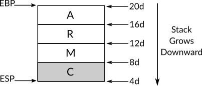
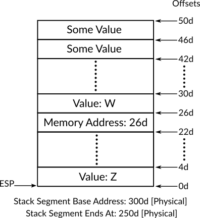
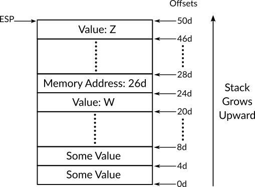
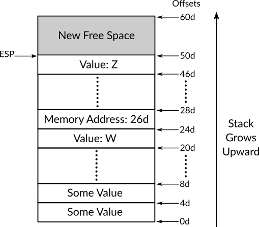

# Chapter 2: An Overview of the x86 Architecture {#ch-x86}

## Introduction
In our situation, and by using modern terminology, we can view the processor as a *library* and *framework*. A library because it provides us with a bunch of instructions to perform whatever we want, and a framework because it has general rules that organize the overall environment of execution, that is, it forces us to work in a specific way. We have seen some aspects of the first part when we have written the bootloader, that is, we have seen the processor as a library. In this chapter, we are going to see how the processor works as a framework by examining some important and basic concepts of x86. We need to understand these concepts to start the real work of writing the 539kernel.

## x86 Operating Modes
In x86 an operating mode specifies the overall picture of the processor, such as the maximum size of available registers, the available advanced features for the running operating system, the restrictions and so on.

When we developed the bootloader in the previous chapter we have worked with an x86 operating mode named *real address mode* (or for short *real mode*) which is an old operating mode that is still supported by modern x86 processors for the sake of backward compatibility. Due to that when the computer is turned on, it initially runs in real mode.

Real mode is a `16-bit` operating mode which means that, maximally, only `16` bits of register size can be used, even if the actual size of the registers is 64-bit. Using only `16` bits of registers has consequences other than the size itself, these consequences are considered as disadvantages in modern days. For example, in real mode the size of the main memory is limited, even if the computer has 16GB of memory, real mode can deal only with 1MB. Furthermore, any code which runs in real mode should be `16-bit` code. For example, the aforementioned `32-bit` registers (such as `EAX`) cannot be used in real mode code, their `16-bit` counterparts should be used instead. As an example, the 16-bit `AX` should be used instead of `EAX` and so on.

Some core features of modern operating systems nowadays are: multitasking, memory protection and virtual memory ^[If some of these terms are new for you don't worry about them too much, you will learn them gradually throughout this book.] and real mode provides nothing to implement these features. However, in modern x86 processors, new and more advanced operating modes have been introduced, namely, *protected mode* which is a `32-bit` operating mode and *long mode* which is a relatively new `64-bit` operating mode. Although the long mode provides more capacity for its users, for example, it can deal with 16 **exabytes** of memory, we are going to focus on protected mode since it provides the same basic mechanisms that we need to develop a modern operating system kernel with the aforementioned features, hence, the 539kernel is a `32-bit` kernel which runs under protected mode.

Since protected mode is a `32-bit` operating mode, `32` bits of registers can be used, also, protected mode has the ability to deal with `4GB` of main memory. Most importantly, it provides important features which we are going to explore through this book that help us in implementing modern operating system kernel features.

As we have said before, *multitasking* is one of the core features that modern operating systems provide. In multitasking environments more than one software can run at the same time, at least virtually, even if there is only one processor or the current processor has only one core. For the sake of making our next discussion easier we should define the term *process* which means a program that is currently running. For example, if your web browser is currently running then this running instance of it is called a process, its code is loaded into the main memory and the processor is currently executing it. Another property of general-purpose operating systems is that they allow the user to run software from unknown sources which means that this software cannot be trusted, it may contain code that intentionally or even unintentionally breaches the security of the system or causes the system to crash. 

Due to these two properties of modern general-purpose operating systems, the overall system needs to be protected from multiple actions. **First**, either in a multitasking or a monotasking ^[That is, the user of the operating system can only run one process at a given time. DOS is an example of monotasking operating system.] environment, the kernel of the operating system which is the most sensitive part of the system, should be protected from current processes. No process should be able to access any part of the kernel's memory either by reading from it or writing to it. Also, no process should be able to call any of kernel's code without kernel's consent. **Second**, the sensitive instructions and registers that change the behavior of the processor (e.g. switching from real-mode to protected-mode) should be only allowed for the kernel which is the most privileged component of the system, otherwise, the stability of the system will be in danger. **Third**, in a multitasking environment the running processes should be protected from each other in the same way the kernel is protected from them, no process should interfere with another.

In x86, the *segmentation* mechanism provided a logical view of memory in real-mode and it has been extended in protected-mode to provide the needed protection which has been described in the third point ^[Segmentation will be examined in details later in this chapter.]. While segmentation can be used in x86 for this kind of protection, it is not the sole way to perform that. The other well-known way is called *paging*, but segmentation is the default in x86 and cannot be turned off while paging is optional. The operating system has the option to use it as a way of memory protection or not.

Also, in the protected-mode the concept of *privilege levels* has been introduced to handle the protections needed in the previous first and second points. The academic literature of operating systems separate the system environment into two modes, *kernel-mode* and *user-mode*, At a given time, the system may run in one of these modes and not both of them at the same time. The kernel runs in kernel-mode, and has the privilege to do anything (e.g. access any memory location, access any resource of the system and perform any operation), while the user applications run in user-mode which is a restricted environment where the code doesn't have the privilege to perform sensitive operations.

This kind of separation has been realized through privilege levels in x86 which provides **four privilege levels** numbered from `0` to `3`. The privilege level `0` is the most privileged level which can be used to realize the kernel-mode while the privilege level `3` is the least privileged which can be used to realize the user-mode. For privilege levels `1` and `2` it's up to the kernel's designer to use them or not, some kernel designs suggest to use these levels for device drivers. According to Intel's manual, if the kernel's design uses only two privilege levels, that is, a kernel-mode and user-mode, then the privilege levels `0` and `3` should be used and not for example `0` and `1`.

In addition to protecting the kernel's code from being called without its consent and protecting kernel's data from being accessed by user processes (as both required by the first point above), the privilege levels also prevent user processes ^[That is, the processes which run on privilege level greater than `0`] from executing *privileged instructions* (as required by second point above). Only the code which runs in the privilege level `0`, that is, the kernel, will be able to execute these instructions since they could manipulate sensitive parts of the processor's environment ^[For example, loading the `GDT` register by using the instruction `lgdt` as we will see later in this chapter.] that only the kernel should maintain. 

When a system uses different privilege levels to run, as in most modern operating systems, the x86 processor maintains what is called *current privilege level* (CPL) which is, as its name suggests, the current privilege level of the currently running code. For example, if the currently running code belongs to the kernel then the current privilege level will be `0` and according to it, the processor is going to decide which operations are allowed. In other words, we can say that the processor keeps tracking the current state of the currently running system and a part of this state is in which privilege level (or mode) the system is currently running.

## Numbering Systems
The processor works with all values as *binary numbers* while it is natural for us as human beings to deal with numbers as *decimal numbers*. A number by itself is an abstract concept, it is something in our mind, but to communicate with each others, we represent the numbers by using symbols which are named *numerals*. For example, the conceptual number `one` can be represented by different *numeral systems*. In the Arabic numeral system the number `one` is expressed as `1`, while in the Roman numeral system it is expressed as `I`.

A numeral system is a *writing system*, that is, it gives us rules of how to write a number down as a symbol, it focuses on the way of writing the numbers. On the other hand, the numbers can be dealt with by a *numbering system*. We use the *decimal numbering system* to deal with numbers, think about them and perform arithmetic operations upon them. The processor uses the *binary numbering system* to do the same with numbers. There are numbering systems other than the decimal and binary numbering systems, and any number can be represented by any numbering system.

A number system is defined by its *base* which is also called *radix*. This base defines the list of available *digits* in the numbering system starting from `0` to `base - 1`. The total count of available digits equals the base. Consider the decimal numbering system, its base is `10` which means the available digits in this system are: `0, 1, 2, 3, 4, 5, 6, 7, 8, 9`, a total of `10` digits. These digits can be used to create larger numbers, for example, `539` which consists of the digits `5`, `3` and `9`.

On the other hand, the base of the binary numbering system is `2`, therefore, the available digits are only `0` and `1`, and as in the decimal numbering system they can be used to compose larger numbers. For example, the number `two` in the binary numbering system is `10` ^[And from here came the well-known joke: "There are 10 types of people in this world, those who understand binary and those who don't".], be careful, this numeral does not represent the number `ten`, it represents the number `two` but in the binary numbering system. When we discuss numbers in different numbering systems, we put the initial letter of the numbering system name at the end of the number. For example, `10d` and `10b` are two different numbers, the first one is `ten` in **d**ecimal while the second one is `two` in **b**inary.

Furthermore, basic arithmetic operations such as addition and subtraction can be performed in the numbering system, for example, in binary `1 + 1 = 10` and they can be performed systematically. Also, a representation of any number in any numbering system can be converted to any other numbering system systematically ^[I think it's too brave to make this claim for any numbering system, however, it holds true at least for the well-known numbering systems.]. While this is not a good place to show how to perform the operations and conversions for different numbering systems, you can find many online resources that explain these operations on the well-known numbering systems.

By now it should be obvious for you that changing the base (radix) gives us a new numbering system and the base can be any number which implies that the count of numbering systems is infinite! One useful and well-known numbering system is *hexadecimal*, its base is `16` and its digits are `0, 1, 2, 3, 4, 5, 6, 7, 8, 9, A, B, C, D, E, F` where `A` means `ten`, `B` means `eleven` and so on. So, why is hexadecimal useful in our situation? Since binary is used in the processor it will be easier to discuss some related entities such as the value of the `FLAGS` register in the binary numbering system because each bit in it represents a value for a different thing. Another example for numbers in the processor are memory addresses. Consider the following example which is a binary number that represents a memory address.

```{.asm}
00000000 00000000 00000000 00000001b
```

Written in the binary numbering system, it is too long and it will be tedious to work with, and for that the hexadecimal numbering system can be useful. Each digit in hexadecimal represents **four** bits ^[Can you tell why? [Hint: How the maximum hexadecimal number `F` is represented in binary?]], that is, the number `0h` in **h**exadecimal is equivalent to `0000b` in binary. A well-known name for an `8`-bit number is a *byte*. In the same way, a `4`-bit number is called a *nibble*. That is, a nibble is a half byte and, as described above, one digit of a hexadecimal number thus represents a nibble. So, we can use hexadecimal numbers to represent the same memory address value in a more elegant way:

```{.asm}
00 00 00 01h
```

| Decimal | Binary | Hexadecimal |
|---------|--------|-------------|
| 0       | 0      | 0           |
| 1       | 1      | 1           |
| 2       | 10     | 2           |
| 3       | 11     | 3           |
| 4       | 100    | 4           |
| 5       | 101    | 5           |
| 6       | 110    | 6           |
| 7       | 111    | 7           |
| 8       | 1000   | 8           |
| 9       | 1001   | 9           |
| 10      | 1010   | A           |
| 11      | 1011   | B           |
| 12      | 1100   | C           |
| 13      | 1101   | D           |
| 14      | 1110   | E           |
| 15      | 1111   | F           |

Table: An Example of How Zero to Fifteen are Represented in the Three Numbering Systems.

## The Basic View of Memory
The basic view of the main memory is that it is an *array of cells*, each cell has the ability to store one byte and it is reachable by a unique number called a *memory address* ^[The architecture in which each memory address points to `1` byte is known as *byte-addressable architecture* or *byte machine*. It is the most common architecture. Of course, other architectures are possible, such as *word-addressable architectures* or *word machines*.]. The range of memory addresses starts from `0` to some limit `x`. For example, if the system has `1MB` of *physical* main memory, then the last memory address in the range will be `1023`. As we know, `1MB` = `1024` bytes and since the range starts from `0` and not `1`, the last memory address in this case is `1023` and not `1024`. This range of memory addresses is known as the *address space* and it can be a *physical address space* which is limited by the physical main memory or a *logical address space*. A well-known example of using the logical address space that we will discuss in a later chapter is *virtual memory* which provides a logical address space of size `4GB` on the `32-bit` architecture even if the actual size of the physical main memory is less than `4GB`. However, the address space starts from the memory address `0`, which is the index of the first cell (byte) of the memory, and it increases by `1`, so the memory address `1` is the index of the second cell of the memory, `2` is the index of third cell of memory and so on. Viewing the memory as an array of contiguous cells is also known as *flat memory model*.

{#fig:memory_physical_view width=75%}

When we say *physical* we mean the actual hardware, that is, when the maximum capacity of the hardware of the main memory (RAM) is `1MB` then the physical address space of the machine is up to `1MB`. On the other hand, when we say *logical* that means it doesn't necessarily represents the actual hardware or obeys the way the actual hardware works, instead it is a hypothetical way of something that doesn't exist in the real world (the hardware). To make the *logical* view of anything work, it should be mapped into the real *physical* view, that is, it should be somehow translated for the physical hardware to be understood. This mapping is handled by the software or sometimes special parts of the hardware.

Now, for the following discussion, let us remind you that the memory address is just a numerical value, it is just a number. When we discuss the memory address as a mere number we call it *memory address value* or *the value of the memory address*, while the term *memory address* keeps its meaning, which is a unique identifier that refers to a specific location (cell) in the main memory.

The values of memory addresses are used by the processor all the time to be able to perform its job, and when it is executing some instructions that involve the main memory (e.g. reading a content from some memory location or dealing with the program counter), the related values of memory addresses are stored temporarily in the registers of the processor. Due to that, the length of a memory address value is bounded to the size of the processor's registers, so, in `32-bit` environments, where the size of the registers is usually `32` bits, the length of the memory address value is **always** `32` bits. Why stressing "always" here? Because even if less than `32` bits are enough to represent a memory address value, it will be represented in `32` bits nevertheless. For example, assume the memory address value `1` in binary. The value `1` can be represented by only `1` bit and no more, but in reality, when it is stored (and handled) by the `32-bit` processor, it will be stored as the following sequence of bits:

```{.c}
00000000 00000000 00000000 00000001
```

As you can see, the value `1` has been represented in exactly `32` bits. Appending zeros to the left doesn't change the value itself, it is similar to writing the number as `0000539` which is exactly `539`.

It has been mentioned earlier that the register size that stores the values of memory addresses in order to deal with memory contents affects the available size of main memory for the system. Take for example the instruction pointer register, if its size is, say, `16` bits then the maximum available memory for code will be `64KB` (`64` KB = `65536` bytes / `1024`) since it is the last reachable memory address by the processor for fetching an instruction. What if the size of the instruction pointer register is `32` bits? Then the maximum available memory for code will be `4GB`. Why is that?

To answer this question let's work with decimal numbers first. If I tell you that you have five blanks, what is the largest decimal number you can represent in these five blanks? The answer is `99999d`. In the same manner, if you have `5` blanks, what is the largest binary number you can represent in these 5 blanks? It is `11111b` which is equivalent to `31d`. The same holds true for the registers that store the value of memory addresses. Given the size of such registers is `16` bits, then there are `16` blanks, and the largest binary number that can be represented in those `16` blanks is `11111111 11111111b` or in hexadecimal `FF FFh`, which is equivalent to `65535d`. That means the last byte a register of size `16` bits can refer to is the byte number `65535d` because it is the largest value this register can store and no more. This leads to the maximum size of the main memory this register can handle, it is `65535 bytes` which is equivalent to `64KB`. The same applies to any other register size.

## x86 Segmentation
The aforementioned view of memory, that is, the *addressable array of bytes* can be considered as the *physical* view of the main memory which specifies the mechanism of accessing the data. On top of this physical view a *logical* view can be created and one example of logical views is *x86 segmentation*.

In x86 segmentation the main memory is viewed as separated parts called *segments* and each segment stores some related data. To access the data inside of a segment, each byte can be referred to by its own *offset*. The running program can be separated into three possible types of segments in x86, these types are: the *code segment* which stores the code of the program, *data segments* which store the data of the program and the *stack segment* which stores the data of program's stack. Segmentation is the default view of memory in x86 and it's unavoidable. The processor always runs with the view that the running program is divided into segments. However, most modern operating systems choose to view the memory as the one described in the flat memory model instead of viewing it as segmented areas. To be able to implement the flat memory model in x86 which doesn't allow segmentation to be disabled, at least two segments (one for code and one for data) should be defined in the system. The size of both segments should be the same as physical memory's size and both segments should start from the first memory address `0` and end at the last memory address (memory size - 1), that is, these both segments will overlap.

{#fig:memory_segmented_view width=35%}

### Segmentation in Real Mode
For the sake of clarity, let's discuss the details of segmentation in real mode first. We have said that logical views (of anything) should be mapped to the physical view either by software or hardware. In this case, the segmentation view is realized and mapped to the architecture of the physical main memory by the x86 processor itself, that is, by the hardware. So, we have a logical view, which is the concept of segmentation which divides a program into separated segments, and the actual physical main memory view which is supported by the real RAM hardware and sees the data as a big array of bytes. Therefore, we need some tools to implement (map) the logical view of segmentation on top of the actual hardware.

For this purpose, special registers named *segment registers* are available in x86, the size of each segment register is `16` bits and they are the following:

- `CS` which is used to define the code segment.
- `SS` which is used to define the stack segment.
- `DS`, `ES`, `FS` and `GS` which can be used to define data segments, which means each program can have up to four data segments.

Each segment register stores the *starting memory address* of a segment and here you can start to observe the mapping between the logical and physical view. In real mode, the size of each segment is `64KB` and as we have said we can reach any byte inside a segment by using the *offset* of the required byte. You can see the resemblance between a memory address of the basic view of memory and an offset of the segmented view of memory ^[The concept and term of an offset is not exclusive to segmentation, it is used for other topics related to memory.].

Let's take an example to make the matter clear. Assume that we have the code of some program loaded into the memory and its starting physical memory address is `100d`. This means, the first instruction of this program is stored in this address and the following instructions are stored right after this memory address one after another. To reach the first byte of this code we use the offset `0`, so, the full physical address of the first byte will be `100:0d`. As you can see, the part before the colon is the starting memory address of the code and the part after the colon is the offset that we would like to reach and read the byte inside it. In the same way, let's assume we would like to reach the offset `33`, which means the byte `34` inside the loaded code. Then the physical address that we are trying to reach is actually `100:33d`. To make the processor handle this piece of code as the *current* code segment, its starting memory address should be loaded into the register `CS`, that is, setting the value `100d` to `CS`. In other words, `CS` must contain the starting memory address of the currently executing code segment (for short: current code segment).

As we have said, the x86 processor always runs with the view that the segmentation is in use. So, let's say it is executing the following assembly instruction `jmp 150d` which jumps to the address `150d`. What really happens here is that the processor considers the value `150d` as an offset instead of a full memory address. So, what the instruction requests from the processor here is to jump to the offset `150` which is inside the current code segment. Therefore, the processor is going to retrieve the value of the register `CS` to know what is the starting memory address of the currently active code segment and add the value `150` to it. Say, the value of `CS` is `100`, then the memory address that the processor is going to jump to is `100:150d`.

This is also applicable to the internal functioning of the processor. Do you remember the register `IP` which is the instruction pointer? It actually stores the offset of the next instruction instead of the whole memory address of the instruction. Any call (or jump) to a code inside the same code segment of the caller is known as *near call (or jump)*, otherwise is it a *far call (or jump)*. Again, let's assume the current value of `CS` is `100d` and you want to call a label which is at the memory location `900:1d`. In this situation you are calling into code that resides in a different code segment. Therefore, the processor is going to take the first part of the address which is `900d`, load it into `CS`, and then load the offset `1d` in `IP`. Because this call causes the change of `CS` value to another value, it is a far call.

Exactly the same is applicable to the other two types of segments and of course, instructions deal with different segment types based on their functionality. For example, you have seen that `jmp` and `call` deal the code segment in `CS`, that's because of their functionality which is related to code. Another example is the instruction `lodsb` which deals with the data segment `DS`, the instruction `push` deals with the stack segment `SS` and so on.

#### Segmentation Used in the Bootloader
In the previous chapter, when we wrote the bootloader, we have dealt with segments. Let's get back to the source code of the bootloader. You remember that the firmware loads the bootloader at the memory location `07C0h` and because of that we started our bootloader with the following lines:

```{.asm}
	mov ax, 07C0h
	mov ds, ax
```

Here, we told the processor that the data segment of our program (the bootloader) starts at the memory address `07C0h` ^[Yes, all segments can be at the same memory location, that is, there is a `64KB` segment of memory which is considered as the currently active code segment, data segment and stack segment. We have already mentioned that when we have discussed how to implement the flat memory model on x86.]. So, if we refer to the memory to read or write **data**, the processor starts with the memory address `07C0h` which is stored in the data segment register `DS` and then it appends the offset that we are referring to. In other words, any reference to data by the code being executed will make the processor use the value in the data segment register as the beginning of the data segment and the offset to referred data as the rest of the address. After that, this physical memory address to the referred data will be used to execute the instruction. An example of an instruction that deals with data in our bootloader is the line `mov si, title_string`.

Now assume that BIOS has set the value of `DS` to `0` (it can be any other value) and jumped to our bootloader, that means the data segment in the system now starts from the physical memory address `0h` and ends at the physical memory address `65535d` since the maximum size of a segment in real-mode is 64KB. Now let's take the label `title_string` as an example and let's assume that its offset in the binary file of our bootloader is `490h`. When the processor starts to execute the line `mov si, title_string` ^[Which loads the physical memory address of `title_string` to the register `SI`.] it will, somehow, figure out that the offset of `title_string` is `490h` and based on the way that x86 handles memory accesses the processor is going to assume that we are referring to the physical memory address `490h` since the value of `DS` is `0h`. But in reality, the correct physical memory address of `title_string` is the offset `490h` **inside** the memory address `07C0h` since our bootloader is loaded into this address and not the physical memory address `0h`. So, to be able to reach to the correct addresses of the data that we have defined in our bootloader and that are loaded with the bootloader starting from the memory address `07C0h` we need to tell the processor that our data segment starts from `07C0h`. Now, for all references to data that are offsets from the start of our bootloader, it should correctly calculate the physical addresses to that data starting from the physical address in `DS`. This is exactly what these two lines do, they change the current data segment to another one which starts at the first memory location of our bootloader.

The second use of segments in the bootloader is when we tried to load the kernel from the disk by using the BIOS service `13h:02h` in the following code:

```{.asm}
	mov ax, 0900h
	mov es, ax
	
	mov ah, 02h
	mov al, 01h
	mov ch, 0h
	mov cl, 02h
	mov dh, 0h
	mov dl, 80h
	mov bx, 0h
	int 13h
```

You can see here, we have used the other data segment `ES` to define a new data segment that starts from the memory address `0900h`. We did that because the BIOS service `13h:02h` loads the required content (in our case the kernel) to the memory address `ES:BX`. For that, we have defined the new data segment and set the value of `BX` to `0h`. That means the code of the kernel will be loaded on `0900:0000h` and because of that, after loading the kernel successfully we perform a far jump:

```{.asm}
jmp 0900h:0000
```

Once this instruction is executed, the value of `CS` will be changed from the value `07C0h`, where the bootloader resides, to the value `0900h` where the kernel resides and the value of `IP` register will be `0000h`. Then the execution of the kernel is going to start.

### Segmentation in Protected Mode
The fundamentals of segmentation in protected mode are exactly the same as the ones explained in real mode, but the functionality has been extended to provide more features such as *memory protection*. In protected mode, a table named *global descriptor table* (`GDT`) is introduced. This table is stored in the main memory and its starting memory address is stored in the special purpose register `GDTR` as a reference. Each entry in this table is called a *segment descriptor* which has the size of `8` bytes and it can be referred to by an index number called *segment selector* ^[This is a **relaxed** definition of the segment selector, a more accurate one will be presented later.] which is the offset of the entry inside `GDT` table. For example, the offset of the first entry in `GDT` is `0`, and adding this offset to the value of `GDTR` gives us the memory address of that entry. However, the first entry of `GDT` should not be used by the operating system. 

An entry in the `GDT` (a segment descriptor), defines a segment (of any type) and has the information that is required by the processor to deal with that segment. The descriptor stores the starting memory address of a segment ^[In real mode, the starting address of a segment is stored directly in the corresponding segment register (e.g. `CS` for code segment).], and the size (or limit) of the segment. The segment selector of the currently active segment should be stored in the corresponding segment register.

To clarify the matter, consider the following example. Let's assume we are currently running two programs and their code is loaded into the main memory and we would like to separate these two pieces of code into a couple of code segments. The memory area `A` contains code of the first program and starts at the memory address `800d` while the memory area `B` contains the code of the second program `B` and starts at the memory address `900d`. Assume that the starting memory address of `GDT` is `500d` which is already loaded in `GDTR`.

To make the processor consider `A` and `B` as code segments we should define a segment descriptor for each one of them. We already know that the size of a segment descriptor is `8d` bytes, so, if we define a segment descriptor for the segment `A` as entry `1` (remember that the entries in the `GDT` start from zero) then its offset (segment selector) in the `GDT` will be `8d` (`1 * 8`). The segment descriptor of `A` should contain the starting address of `A` which is `800d`, and we will define the segment descriptor of `B` as entry `2` which means its offset (segment selector) will be `16d` (`2 * 8`).

Let's assume now that we want the processor to execute the code of segment `A`. We already know that the processor consults the register `CS` to decide which code segment is currently active and should be executed next. For that, the **segment selector** of code segment `A` should be loaded in `CS`, so the processor can start executing it. In real mode, the value of `CS` and all other segment registers was a memory address, on the other hand, in protected mode, the value of `CS` and all other segment registers is a segment selector.

In our situation, the processor takes the segment selector of `A` from `CS` which is `8d` and starting from the memory address which is stored in `GDTR` it walks `8` bytes. So, if `GDTR` is `500d`, the processor will find the segment descriptor of `A` in the memory address `508d`. The starting address of `A` will be found in its segment descriptor and the processor can use it with the value of register `EIP` to execute `A`'s code. Let's now consider how a far jump is performed from `A` to `B`. The value of `CS` will be changed to the segment selector of `B` which is `16d`.

#### The Structure of the Segment Descriptor
A segment descriptor is an `8` bytes long entry in the global descriptor table which stores multiple *fields* and *flags* that describe the properties of a specific segment in the memory. For every memory reference to any segment, the processor is going to consult the segment descriptor that describes the segment in question to obtain basic information like the starting memory address of this segment.

Beside the basic information, a segment descriptor stores information that helps protecting memory. Due to that, segmentation in x86 protected-mode is considered as a way for memory protection and not a mere logical view of the memory, so each memory reference is being monitored by the processor. 

By using the properties that are related to memory protection, the processor will be able to protect the different segments in the system from each other and not letting some less privileged code to call code or manipulate data that belongs to a more privileged area of the system. A concrete example of that is when some userspace software (e.g. a web browser) tries to modify an internal data structure of the kernel. 

In the following subsections, each field and flag of the segment descriptor will be explained. But before getting started we need to note that in this book and in Intel's official x86 manual the term *field* is used when the size of the value that should be stored in the descriptor is **more than** `1` bit. For example the segment's starting memory address is stored in the first `4` bytes, because it's larger than `1` bit the place where this address is stored in the descriptor is called a field. Otherwise when the term *flag* is used that means the size of the value is `1` bit.

##### Segment's Base Address and Limit
The most important information about a segment is its starting memory address, which is called the *base address* of a segment. In real mode, the base address was stored in the corresponding segment register directly, but in protected mode, where we have more information about a segment than mere base address, this information is stored in the segment descriptor ^[Reminder: In protected mode, the corresponding segment register stores the selector of the currently active segment.].

When the currently running code refers to a memory address to read from it, write to it (in the case of data segments) or call it (in the case of code segments) it is actually referring to a specific segment in the system ^[And it **must**, since segmentation is enabled by default in x86 and cannot be disabled.]. For the simplicity of the upcoming discussions, we call the memory address, which is referenced by the currently running code, the *generated memory address* because, you know, it is generated by the code.

Any generated memory address in the x86 architecture is not an actual physical memory address ^[Remember our discussion of the difference between our logical view of the memory (e.g. segmentation) and the actual physical hardware]. That means, if you hypothetically get a generated memory address and try to get the contents of its physical memory location, the obtained data will not be the data which is required by the code. Instead, a generated memory address is named by Intel's official manual a *logical memory address* because, you know, it is not the physical memory address, **it is** logical. Every logical memory address refers to some byte in a specific segment in the system, and to be able to obtain the data from the actual physical memory, this logical memory address should be *translated* to a *physical memory address* ^[We can see here how obvious the mapping is between the logical view of the memory and the physical memory.].

A logical memory address in x86 may pass **two** translation steps instead of one in order to obtain the physical memory address. The first address translation is performed on a logical memory address to obtain a *linear memory address* which is another not real and not physical memory address which exists in the x86 architecture because of the paging feature. If paging ^[Don't worry about paging right now. It will be discussed later in this book. All you need to know now is that paging is another logical view of the memory. Paging is disabled by default in x86 which makes it an optional feature unlike segmentation.] is enabled in the system, a second translation step takes place on this linear memory address to obtain the real physical memory address. If paging is disabled, the linear memory address which is generated by the first translation step is the same as the physical memory address. We can say that the first translation step is there in x86 due to the segmentation view of memory, while the second translation step is there in x86 due to the paging view of memory.

{#fig:logical_memory_address_translation width=90%}

For now, our focus will be on the translation from a logical memory address to a linear memory address which is same as the physical memory address since the paging feature is disabled by default in x86. Each logical memory address consists of two parts, a `16-bit` segment selector and a `32-bit` offset. When the currently running code generates a logical memory address (for instance, to read some data from memory) the processor needs to perform the translation process to obtain the physical memory address as the following. First, it reads the value of the register `GDTR` which contains the starting physical memory address of `GDT`, then it uses the `16-bit` segment selector of the generated logical address to locate the descriptor of the segment that the code would like to read the data from. Inside the segment's descriptor, the physical base address (the starting physical address) of the requested segment can be found. The processor obtains this base address and adds the `32-bit` offset from the logical memory address to the base address to obtain the final result, which is the linear memory address.

During this operation, the processor uses the other information in the segment descriptor to enforce the policies of memory protection. One of these policies is defined by the *limit* of a segment which specifies its size. If the generated logical address refers to an offset which exceeds the limit of the segment, the processor stops this operation. For example, assume hypothetically that the running code has the privilege to read data from data segment `A` and in the physical memory another data segment `B` is defined right after the limit of `A`. This means if we can exceed the limit of `A` we will able to access the data inside `B` which is a critical data segment that stores kernel's internal data structures and we don't want any unprivileged code to read from it or write to it. This can be achieved by specifying the limit of `A` correctly, and when the unprivileged code tries maliciously/by mistake to read from `B` by generating a logical memory address that has an offset which exceeds the limit of `A` the processor prevents the operation and protects the contents of segment `B`.

The limit, or in other words, the size of a given segment is stored in the `20` bits *segment limit field* of that segment descriptor. How the processor interprets the value of the segment limit field depends on the *granularity flag* (`G` flag) which is also stored in the segment's descriptor. When the value of this flag is `0` then the value of the limit field is interpreted as bytes. Let's assume that the limit of a given segment is `10d` and the value of granularity flag is `0`, that means the size of this segment is `10` **bytes**. On the other hand, when the value of the granularity flag is `1`, the value of the segment limit field will be interpreted as `4KB` units. For example, assume in this case that the value of the limit field is also `10d` but the `G` flag = `1`, that means the size of the segment will be `10` of `4KB` units, that is, `10 * 4KB` which gives us `40KB` which equals `40960` bytes.

Because the size of the segment limit field is `20` bits, that means the maximum numeric value it can represent is `2^20 = 1,048,576`, which means if the `G` flag equals `0` then the maximum size of a specific segment can be `1,048,576` **bytes** which equals `1MB`, and if the `G` flag equals `1` then the maximum size of a specific segment can be `1,048,576` of `4KB` units which equals `4` **GB**.

Getting back to the structure of the descriptor, the bytes `2`, `3` and `4` of the descriptor store the *least significant bytes* of segment's base address and the byte `7` of the descriptor stores the *most significant byte* of the base address, the total is `32` bits for the base address. The bytes `0` and `1` of the descriptor store the *least significant bytes* of segment's limit and byte `6` stores the *most significant byte* of the limit. The granularity flag is stored in the most significant **bit** of the byte `6` of the descriptor.

Before finishing this subsection, we need to define the meaning of *least significant* and *most significant* byte or bit. Take for example the following binary sequence which may represent anything, from a memory address value to a `UTF-32` character:

**0**111 0101 0000 0000 0000 0000 0100 110*1*

You can see the first bit from left is formatted in bold and its value is `0`. Based on its position in the sequence we call this bit the *most significant bit* or *high-order bit*. The last bit to the right, which is formatted in italic, has the value `1`. It is known as the *least significant bit* or *low-order bit*. The same terms can be used on byte level. Given the same sequence with different formatting:

**0111 0101** 0000 0000 0000 0000 *0100 1101*

The first byte (`8` bits) to the left which is formatted in bold which has the value `0111 0101` is known as *most significant byte* or *high-order byte*. The last byte to the right which is formatted in italic which has the value `0100 1101` is known as the *least significant byte* or *low-order byte*.

Now, imagine that this binary sequence is the base address of a segment, then the least significant `3` bytes of it will be stored in bytes `2`, `3` and `4` of the descriptor, that is, the following binary sequence:

```{.asm}
0000 0000 0000 0000 0100 1101
```

While the most significant byte of the binary sequence will be stored in the `7th` byte of the descriptor, that is, the following binary sequence:

```{.asm}
0111 0101
```

##### Segment's Type
Given any binary sequence, it doesn't have any meaning until some context is added. For example, what does the binary sequence `1100 1111 0000 1010` represents? It could represent anything, a number, characters, pixels on an image or even all of them based on how its user interprets it. When an agent (e.g. a bunch of code in running software or the processor) works with a binary sequence, it should know what this binary sequence represents to be able to perform useful tasks with it. In the same manner, when a segment is defined, the processor (the agent) should be told how to interpret the contents inside this segment, that is, the type of the segment must be known by the processor.

Till this point, you probably noticed that there are at least two types of segments, code segments and data segments. The contents of the former should be machine code that can be executed by the processor to perform some tasks, while the contents of the latter should be data (e.g. values of constants) that can be used by the running code. These two types of segments (code and data) belong to the category of *application segments*, there is another category of segment types which is the category of *system segments*, many different segment types belong to it.

The type of the segment, whether it's an application or system segment, should be mentioned in the descriptor of the segment in a flag called *`S` flag* or *descriptor type flag* which is the fifth **bit** in **byte** number `5` of the segment descriptor. When the value of the `S` flag is `0`, then the segment is considered to be a system segment, while it is considered to be an application segment when the value of the `S` flag is `1`. Our current focus is on the latter case.

As we have mentioned before, an application segment can be either code or data segment. Let's assume some application segment has been referenced by the currently running code. The processor is going to consult the descriptor of this segment, and by reading the value of the `S` flag (which should be `1`) it will know that the segment in question is an application segment. But which of the two types? Is it a code segment or data segment? To answer this question for the processor, this information should be stored in a field called the *type field* in the segment's descriptor.

Type field in the segment descriptor consists of the first `4` bits (nibble) of the fifth byte and the most significant bit specifies if the application segment is a code segment (when the value of the bit is `1`) or a data segment (when the value of the bit is `0`). Irrespective of whether the segment is a code or a data segment, in both cases the least significant bit of the type field indicates if the segment is *accessed* or not. When the value of this flag is `1`, then the segment has been written to or read from (AKA: accessed), but if the value of this flag is `0`, the segment has not yet been accessed. The value of this flag is manipulated by the processor in one situation only, and that happens when the selector of the segment in question is loaded into a segment register. In any other situation, it is up to the operating system to decide the value of the accessed flag. According to Intel's manual, this flag can be used for virtual memory management and for debugging.

###### Code Segment Flags
When the segment is a code segment, the second most significant bit (tenth bit) is called *conforming flag* (also called `C` flag) while the third most significant bit (ninth bit) called *read-enabled flag* (also called `R` flag.). Let's start our discussion with the simplest of those two flags which is the read-enabled flag. The value of this flag indicates how the code inside the segment in question can be used, when the value of read-enabled flag is `1` ^[Which means **do** enable read, since `1` is equivalent to `true` in the context of flags.], that means the contents of the code segment can be executed **and** read from, but when the value of this flag is `0` ^[Which means **don't** enable read.] that means the contents of the code segment can be **only** executed and cannot be read from. The former option can be useful when the code contains data inside it (e.g. constants) and we would like to provide the ability of reading this data. When read is enabled for the segment in question, the selector of this segment can also be loaded into one of data segment registers ^[Which makes sense, enabling reads from a code segment means it also contains data.].

The conforming flag is related to the privilege levels that we had an overview of previously in this chapter. When a segment is conforming, in other words, when the value of the conforming flag is `1`, that means that code which runs in a less-privileged level can call into this segment which requires a higher privilege level while keeping the current privilege level of the environment of the caller instead of changing the privilege level to the level required by the callee.

For example, let's assume for some reason a kernel's designer decided to provide simple arithmetic operations (such as addition and subtraction) for user applications from the kernel code, that is, there is no other way to perform these operations in that system but using the code provided by the kernel. As we know, the kernel's code should run in privilege level `0` which is the most-privileged level. Let's assume a user application which runs in privilege level `3`, a less-privileged level, needs to perform an addition operation. In this case the kernel code, which should be protected by default from being called by less-privileged code, should be called to perform the task. This can only be realized if the code of the addition operation is provided as a conforming segment, otherwise the processor is going to stop this operation because the less-privileged code tries to call the more-privileged code.

You should also note that the code of the addition operation is going to run in privilege level `3` although it is a part of the kernel which runs in privilege level `0` and that's because the original caller runs in the privilege level `3`. Furthermore, although a conforming segment can be called by the less-privileged code (e.g. user application calls the kernel), the opposite cannot be done (e.g. the kernel calls the user application's code) and the processor is going to stop the operation.

###### Data Segment Flags
When the segment is a data segment, the second most significant bit (tenth bit) is called expansion-direction flag (also called `E` flag) while the third most significant bit (ninth bit) is called write-enabled flag (also called `W` flag). The latter one gives us the ability to make some data segment read-only when its value is `0`, or we can make a data segment both **writable** and readable by setting the value of the write-enabled flag to `1`.

While the expansion-direction flag and its purpose will be examined in details when we discuss the x86 run-time stack in this chapter, what we need to know right now is that when the value of this flag is `0`, the data segment is going to expand **up** (in Intel's terms), but when the value of this flag is `1`, the data segment is going to expand **down** (in Intel's terms).

A last note about data segments is that all of them are **non-conforming**, that is, the less-privileged code cannot access a data segment in a more-privileged level. Furthermore, all data segments can be accessed by the more-privileged code.

##### Segment's Privilege Level
In our previous discussions, we have stated that a specific segment should belong to a privilege level and based on this privilege level the processor decides the protection properties of the segment in question. It decides, for example, whether that segment is a kernel-mode or user-mode segment and which privilege level the running code should belong to in order to be able to reach to this segment.

A field called the *descriptor privilege level* (DPL) in the segment descriptor is where the operating system should set the privilege level of a given segment. The possible values of this field, as we know, are `0d` (`00b`), `1d` (`01b`), `2d` (`10b`) and `3d` (`11b`), we have already discussed the meanings of these values previously in this chapter. The descriptor privilege level field occupies the second and third most significant bits of byte `5` in a descriptor.

##### Segment's Presence
One of the common operations that is performed in a running system is loading data from secondary storage (e.g. hard disk) into the memory and one example of that is loading the program code into the memory when the user of the system requests to run an instance of a program. So, creating a new segment descriptor (hence, creating new segment in the memory) for this data may precede the completion of loading the data into the main memory. Therefore, there could be some segment descriptors in the system that point to memory locations that don't contain the final data yet.

In this case, we should tell the processor that the data in the memory location that a specific descriptor points to is not the final data, and the segment is not presented in the memory yet. This helps the processor to generate errors when some code tries to access ^[We use the term *access* here for both types of application segments. While this term is valid for data segments, we mean *execute* for code segments.] the segment's data. To tell the processor whether a segment is present in the memory or not, *segment-present flag* (`P` flag) can be used. When its value is `1` it means that the segment is present in memory, while the value of `0` means the segment is not present in memory. This flag is the most significant bit of byte `5` of a descriptor.

##### Other Flags
We have now covered almost all segment's descriptor fields and flags but three flags. The name of the first one of them changes depending on the type of the segment and it occupies the second most significant bit in the byte `6`. When the segment in question is a code segment, this flag is called the *default operation size* (`D` flag). When the processor executes the instructions it uses this flag to decide the length of the operands, depending on the currently executing instruction. If the value of the `D` flag is `1` the processor is going to assume the operand has the size of `32` bits if it is a memory address, and `32` bits or `8` bits if it isn't a memory address. If the value of the `D` flag is `0` the processor is going to assume the operand has the size of `16` bits if it is a memory address, and `16` bits or `8` bits if it isn't a memory address. 

When the segment in question is a stack segment ^[The processor knows it is a stack segment if the segment selector is loaded into the stack segment selector register `SS`.], the same flag is called the *default stack pointer size* (`B` flag), and it changes the size of the memory address (as a value) which points to the stack. This memory address is known as the *stack pointer* and it is being used implicitly by the stack instructions such as `push` and `pop`. When the value of the `B` flag is `1`, then the size of the stack pointer will be `32` bits and its value will be stored in the register `ESP` (rather then `SP`). When the value of the `B` flag is `0`, then the size of the stack pointer will be `16` bits and its value will be stored in the register `SP` (rather then `ESP`). 

When the segment in question is a data segment that grows upwards, this flag is called the *upper bound flag* (`B` flag), when its value is `1` the maximum possible size of the segment will be `4GB`. Otherwise, the maximum possible size of the segment will be `64KB`. Anyway, the value of this flag (`D`/`B` flag) **should** be `1` for `32-bit` code and data segments (stack segments are included of course) and it should be `0` for `16-bit` code and data segments.

The second flag is known as the *64-bit code segment flag* (`L` flag) which is the third most significant bit in the byte `6` and from its name we can tell that this flag is related to code segments. If the value of this flag is `1` it means the code inside the segment in question is `64-bit` code while the value `0` means otherwise ^[In terms of Intel's manual: *compatibility mode*.]. When we set the value of the `L` flag to `1` the value of `D`/`B` flag should be `0`.

The final flag is the fourth most significant bit in the byte `6`, the value of this flag has no meaning for the processor, hence, it will not use it to make any decisions upon the segment in question as we have seen on all other flags and fields. On the other hand, this flag is available for the operating system to use it in whatever way it needs, or just ignoring it by setting it to any of the possible values, `0` or `1` since it is one bit wide.

#### The Special Register `GDTR`
The special register `GDTR` stores the base physical address ^[More accurately, the linear address. Refer to the discussion of the memory translation process in this chapter.] of the global descriptor table, that is, the starting point of the `GDT` table. Also, the same register stores the limit (or size) of the table.

{#fig:16062021_0 width=50%}

To load a value into the register `GDTR` the x86 instruction `lgdt` should be used, which stands for *load* global descriptor table. This instruction takes one operand which is the whole value that should be loaded into `GDTR`, the structure of this value should be similar to the structure of `GDTR` itself which is shown in figure @fig:16062021_0. The figure shows that the total size of `GDTR` is `48` bits divided into two parts. The first part starts from bit `0` (the least significant bit) to bit `15`. This part contains the limit (size) of `GDT` table that we would like to load. The size of this part of the `GDTR` register is `16` bits which can represent the value `65,536` at maximum. That means the maximum size of the `GDT` table can be `64KB = 65,536 bytes / 1024`. As we know, the size of each descriptor is `8` bytes, that means the `GDT` table can hold `8,192` descriptors at most. The second part of `GDTR` goes from bit `16` to bit `47` (the most significant bit) and stores the base memory address of the `GDT` table that we would like to load.

#### Local Descriptor Table
The global descriptor table is a system-wide table, in other words, it is available for every process of the system. In addition to the `GDT`, x86 provides us with the ability to define *local descriptor tables* (`LDT`) in protected-mode which have the same functionality and structure as the `GDT`.

In contrast to the `GDT` table, multiple `LDT`s can be defined in the system, and each one of them can be private to a specific process that is currently running on the system. Also, multiple running processes can share a single `LDT` that is considered private for them by the kernel and no other process is allowed to reach this given `LDT`. Anyway, how to use `LDT`s depends on how the kernel is designed, and while the `GDT` is required in x86 protected-mode architecture by default, `LDT`s are optional and the designer of the kernel is the one who is responsible to decide whether to use `LDT`s or not.

Let's assume that we need to create a new `LDT` table for process `A` which is currently running on the system. This `LDT` table is already filled with the descriptors that describe the segments which belong to process `A`. The structure of the descriptors in the `LDT` is exactly same as the one that we already described in this chapter. To tell the processor that a given region of memory is an `LDT` table, a new segment descriptor should be created in the `GDT`.

In our previous discussion of the `S` flag we mentioned that this flag tells the processor whether a defined segment is an application segment (`S` flag = `1`) or a system segment (`S` flag = `0`). The segment of the memory that contains an `LDT` table is considered a system segment, that is, the value of the `S` flag in the descriptor that describes an `LDT` table should be `0` and because there are other types of system segments than `LDT`, we should tell the processor this system segment is an `LDT` table. To do that we should use the type field of the descriptor that we already mentioned. The value of this field should be `0010b` (`2d`) for descriptors that describe an `LDT` table. How the processor can tell which table should currently be used for a given segment, the `GDT` or the `LDT`, will be discussed in the next subsection.

The x86 instruction `lldt` is used to load the `LDT` table that we would like to use into a special register named `LDTR` which is a `16-bit` register. It should contain the segment selector ^[More accurate definition of a segment selector and its structure in protected-mode is presented in the next subsection.] in the `GDT` table of the `LDT` table that we would like to use. In other words, the index of the segment descriptor which describes the `LDT` table and which resides in the `GDT` as an entry should be loaded into `LDTR` register.

#### Segment Selector
As we know, the index (offset) of the descriptor that the currently running code needs to use, whether this descriptor defines a code or a data segment, should be loaded into one of segment registers, but how the can the processor tell if this index which is loaded into a segment register is an index in the `GDT` or the `LDT`?

{#fig:17062021_0 width=50%}

When we discussed segment selectors previously in this chapter we have said that our definition of this concept is a **relaxed** definition, that is, a simplified one that omits some details. In reality, the index of a segment descriptor is just one part of a segment selector. The figure @fig:17062021_0 shows the structure of a segment selector, which has the same structure for all segment registers `CS`, `SS`, `DS`, `ES`, `FS` and `GS`. We can see from the figure that the size of a segment selector is `16` bits and starting from the least significant bit (bit `0`), the first two bits `0` and `1` are occupied by a field known as the *requester privilege level* (`RPL`). Bit `2` is occupied by a flag named *table indicator* (`TI`), and finally, the index of a segment descriptor occupies the field from bit `3` until bit `15` of the segment selector. The index field (descriptor offset) is already well-explained in this chapter, so we don't need to repeat its details.

The table indicator flag (`TI`) is the one which is used by the processor to tell if the index in the segment selector is an index in `GDT`, when the value of `TI` is `0`, or `LDT`, when the value is `1`. When it's the latter case, the processor consults the register `LDTR` to get the index of the descriptor that defines the current `LDT` in the `GDT`. By using this index, the descriptor of the `LDT` is read from the `GDT` by the processor to fetch the base memory address of the current `LDT`. After that, the index in the segment selector register can be used to get the required segment descriptor from the current `LDT` by using the latter base memory address that just been fetched. Of course these values are cached by the processor for quick future access.

In our previous discussions of privilege levels we have discussed two values, current privilege level (`CPL`) which is the privilege level of the currently executing code and descriptor privilege level (`DPL`) which is the privilege level of a given segment. The third value which contributes to the privilege level checks in x86 is the *requester privilege level* (`RPL`) which is stored in the segment selector. Necessarily, the `RPL` has four possible values: `0`, `1`, `2` and `3`.

To understand the role of `RPL` let's assume that a process `X` is running in the user-mode, that is, in privilege level `3`. This process is a malicious process that aims to gain the access to some important kernel's data structure. At some point of time the process `X` calls the code in the kernel and passes the segment selector of the more-privileged data segment to it as a parameter. The kernel code runs in the most privileged level and can access all privileged data segments by simply loading the required data segment selector to the corresponding segment register. In this case the `RPL` is set to `0` maliciously by process `X`. Since the kernel runs in the privilege level `0` and `RPL` is `0`, the required segment selector by process `X` will be loaded and the malicious process `X` will be able to gain access to the data segment that has the sensitive data.

To solve this problem, `RPL` should be set to the **requester** privilege level by the kernel to load the required data segment. In our example, the requester (the caller) is the process `X` and its privilege level is `3`. The current privilege level is `0` since the kernel is running, but because the caller has a less-privileged level the kernel should set the `RPL` of the required data segment selector to `3` instead of `0`. This tells the processor that while the currently running code is in the privilege level `0` the code that called it was running in the privilege level `3`, so, any attempt to reach a segment for a privilege level higher (`DPL` is smaller) than the selector's privilege level (`RPL` is greater) should be denied. In other words, the kernel should not reach into privileged segments on behalf of process `X`. The x86 instruction `arpl` can be used by the kernel code to change the `RPL` of the segment selector to the privilege level of the caller that has requested the access to the higher-privileged segment, as in the example of process `X`.


## x86 Run-time Stack
A user application starts its life as a file stored on the user's hard disk. At this stage it does nothing, it is just a bunch of binary numbers that represent the machine code of this application. When the user decides to use this application and opens it, the operating system loads this application into the memory and in this stage this user application becomes a process. We mentioned before that the term "process" is used in operating system literature to describe a running program. Another well-known term is a *task* which is used by the Linux kernel and has the same meaning.

Typically, the memory of a process is divided into multiple regions and each one of them stores a different kind of the application's data. One of those regions stores the machine code of the application in the memory. There are also two other important regions of process' memory. The first one is known as the *run-time heap* (or just **heap** for short) which provides an area for dynamically allocated objects (e.g. variables). The second one is known as the *run-time stack* (or **stack** for short), it's also known as the *call stack* but we are going to stick to the term run-time stack in our discussions. Please note that the short names of run-time stack (that is, stack) and run-time heap (that is, heap) are also names for **data structures**. As we will see shortly, a data structure describes a way of storing data and how to manipulate this data. In our current context, however, these two terms are used to represent **memory regions** of a running process although the stack (as a memory region) uses the stack data structure to store the data. Due to that, here we use the more accurate term *run-time stack* to refer to the memory region and *stack* to refer to the data structure.

The run-time stack is used to store the values of local variables and function parameters. We can say that the run-time stack is a way to implement *function invocation*. It describes how a function `A` can call a function `B`, pass it some parameters, return back to the same point of code where function `A` called function `B` from and finally get the returned value from the function `B`. The implementation details of these steps are known as *calling convention* and the run-time stack is one way of realizing these steps. There are multiple known calling conventions for x86. Different compilers and operating systems may implement different calling conventions. We are not going to cover those different methods but what we need to know is that, as we said, those different calling conventions use the run-time stack as a tool to realize function invocation. The memory region in x86 which is called run-time stack uses a data structure called *stack* to store the data inside it and to manipulate that data.

### The Theory: The Stack Data Structure
Typically, a *data structure* as a concept is divided into two components. The first one is the way of storing the data in high-level terms. A data structure is not concerned about how to store the data in low-level terms (e.g as bits or bytes, in the main memory or on the disk, etc.). But it answers the question of how to store data as a high-level concept (as we will see in the stack example) without specifying the details of implementation and due to that, they are called *abstract data structures*. The second component of a data structure are the available operations to manipulate the stored data. Of course, the reason of the existence of each data structure is to solve some kind of a problem.

In the stack data structure, the data will be stored in last-in-first-out (LIFO) manner ^[As a counterexample, the *queue data structure* stores data in **first**-in-first-out (FIFO) manner.], that is, the last entry which is stored on the stack can be fetched out of the stack at first. There are two operations of the stack data structure: *push* and *pop* ^[That doesn't mean no more operations can be defined for a given data structure on the implementation level. It only means that the conceptual perspective for a given data structure defines those basic operations which reflect the spirit of that data structure. Remember that when we start to use the x86 run-time stack with more operations than `push` and `pop` later. Although those other operations are not canonical to the stack data structure, they can be available if the use case requires that (and yes they may violate the spirit of the given data structure! We will see that later).]. The first one, `push`, **puts** some value on the *top of the stack*, which means that the top of stack always contains the last value that have been inserted (pushed) onto a stack. The latter operation, `pop`, **removes** the value which resides on the top of the stack and returns it to the user, that means the most recent value that has been `push`ed to the stack will be fetched and removed from the stack when we `pop` the stack.

{#fig:abcd-stack-step1 width=35%}

Let's assume that we have the string `ABCD` and we would like to push each character separately onto the stack. First we start with the operation `push A` which puts the value `A` on the top of the stack, then we execute the operation `push B` which puts the value `B` on top of the value `A` as we can see in the figure @fig:abcd-stack-step1. That is, the value `B` is now on the top of the stack and not the value `A`. The same is going to happen if we push the value `C` next as you can see in the figure @fig:abcd-stack-step2 and the same for the value of `D` and you can see the final stack of these four push operations in figure @fig:abcd-stack-step3.

{#fig:abcd-stack-step2 width=35%}

{#fig:abcd-stack-step3 width=35%}

Now let's assume that we would like to read the values from this stack. The only way to read data from the stack data structure is to use the operation `pop` which, as we have mentioned, removes the value that resides on the top of the stack and returns it to the user. That is, the stack data structure in contrary to the array data structure ^[Which is implemented by default in most major programming languages and know as arrays (in C for example) or lists (as in Python)] doesn't have the property of allowing *random access* to the data. So, if you want to access any data in the stack, you can only use `pop` to do that. That means if you want to read the first pushed value onto the stack, then you need to `pop` the stack `n` times, where `n` is the number of pushed elements onto the stack, in other words, the size of the stack.

In our example stack, to be able to read the first pushed value which is `A` you need to `pop` the stack four times. The first one removes the value `D` from the top of the stack and returns it to the user, which makes the values `C` be on the top of the stack as you can see in figure @fig:abcd-stack-step2. If we execute `pop` once again, the value `C` will be removed from the top of the stack and will be returned to the user, which makes the value `B` be on the top of the stack as you can see in figure @fig:abcd-stack-step1. We need to `pop` the stack two more times the get the first `push`ed value which is the value `A`. This example makes it obvious for us why the stack data structure is described as last-in-first-out data structure.

The stack data structure is one of the most basic data structures in computer science and there are many well-known applications that can use a stack to solve a specific problem in an easy manner. To take an example of applications that can use a stack to solve a specific problem let's get back to our example of `push`ing `ABCD` onto a stack, character by character and then `pop`ping them back. The input is `ABCD` but the output of the `pop` operation is `DCBA` which is the reverse string of the input. So, the stack data structure can be used to solve the problem of getting the reversed string of an input by just pushing it onto a stack character by character and then popping this stack, concatenating the returned character with the previously returned character, until the stack is empty. Other problems that can be solved easily with stacks are the palindrome problem and the parenthesis matching problem which is an important one for the part of programming languages' compilers and interpreters known as the parser.

As you can see in this brief explanation of the stack data structure, we haven't mentioned any implementation details which means that a specific data structure is an abstract concept that describes a high-level idea where the low-level details are left for the implementer.

### The Implementation: The x86 Run-Time Stack
Now, with our understanding of the theoretical aspect of the stack data structure, let's see how the run-time stack is implemented in the x86 architecture to be used for the objectives that we have mentioned at the beginning of the subsection. As we have said earlier, the reason of the x86 run-time stack's existence is to provide a way to implement function invocation, that is, the lifecycle of functions. Logically, we know that a program consists of multiple functions (or *routines* which is another term that is used to describe the same thing) and when executing a program (a process), a number of these functions (not necessarily all of them) should be called to fulfill the required job.

In the run-time context, a function `B` starts its life when it's called by another function `A`. So, the function `A` is the *caller*, that is, the function that originated the call, and the function `B` is the *callee*. The caller can pass a bunch of parameters to the callee. The callee can reach the values of these parameters while it's running and it can define its own local variables which should not be reached by any other function. That means that these variables can be removed from the memory once the callee finishes its job. When the callee finishes its job, it may *return* some value to the caller ^[Some programming languages, especially those which are derived from Algol differentiate between a *function* which **should** return a value to the caller, and a *procedure* which **shouldn't** return a value to the caller.]. Finally, the run-time platform (the processor in the case of compiled languages) should be able to know, when the callee finishes and the location of the code that should be executed next. Logically, this place is the line in the source code of the caller function which is next to the line that called the callee in the first place.

In x86, each process has its own run-time stack ^[We claim that for the purpose of explanation. But actually the matter of a separated run-time stack for each process is a design decision that the operating system's kernel programmer/designer is responsible for.]. We can imagine this run-time stack as a big (or even small, that depends on practical factors) memory region that obeys the rules of the stack data structure. This run-time stack is divided into multiple mini-stacks, more formally, these mini-stacks are called *stack frames*. Each stack frame is dedicated to **one** function which has been called during the execution of the program. Once this function exits, its frame will be removed from the larger process stack, hence, it will be removed from the memory.

The x86 register `EBP` (which is called the *stack frame base pointer*) contains the starting memory address of the current stack frame, and the register `ESP` (which is called the *stack pointer*) contains the memory address of the top of the stack. To push a new item into the run-time stack, the x86 instruction named `push` can be used with the value of the new item as an operand. This instruction decrements the value of `ESP` to get a new *starting* memory location to put the new value on and to keep `ESP` pointing to the top of the stack. Decrementing the value of `ESP` means that the newly pushed items are stored in a lower memory location than the previous value and that means the run-time stack in x86 *grows downwards* in the memory.

When we need to read the value on the top of the stack and remove this value from the stack, the x86 instruction `pop` can be used. It is going to store the value (which resides on the top of stack) in the specified location of its operand. This location can be a register or a memory address. After that, the `pop` operation increments the value of `ESP`, so the top of stack now refers to the previous value. Note that the `pop` instruction only increments `ESP` to get rid of the popped value and doesn't clear it from memory by, for example, writing zeros in its place. This is better for performance. This also is one of the reasons that when you refer to some random memory location, for example with C pointers, and you see some weird value that you probably don't remember having stored in the memory, this value may have been pushed onto the run-time stack previously by some different function call and its frame has afterwards been removed. This same practice is also used in modern filesystems for the sake of performance. When you delete a file the filesystem actually doesn't write zeros at the place of the original content of the file, instead, it just refers to the freed location as a free space on the disk, and maybe some day this location will be used to store another file (or part of it). This is when the contents of the deleted file are actually cleared (overwritten) on the disk.

Let's get back to the x86 run-time stack. To make it clear how `push` and `pop` work, let's consider an example. Assume that the current memory address of the top of the stack (`ESP`) is `102d` and we executed the instruction `push A` where `A` is a character encoded in `UTF-16` which means its size is `2` bytes (`16` bits) and it is represented in hexadecimal as `0410h`. By executing this `push` instruction the processor is going to subtract `2` from `ESP` (because we need to push `2` bytes onto the stack) which gives us the new memory location `100d`. Then the processor stores the first byte of `UTF-16` `A` (`04h`) at the location `100d` and the second byte (`10h`) at the location `101d` ^[In fact, x86 is a little-endian architecture which means that `10h` will be stored at the location `100d` while `04h` will be stored at the location `101d` but I've kept the example in the main text as is for the sake of simplicity.]. The value of `ESP` will be changed to `100d` which now represents the top of the stack.

When we need to `pop` the character `A` from the top of the stack, both bytes should be read and `ESP` should be **incremented** by `2`. In this case, the new memory location `100d` can be considered as a *starting* location of the data because it doesn't store the whole value of `A` but only a part of it. The case where the new memory location is not considered a starting memory location is when the newly pushed values is pushed as a whole to the new memory location, that is, when the size of the value to push is `1` byte.

### Calling Convention
When a function `A` needs to call another function `B`, as a first step `A` (the caller) should push the parameter that should be passed to `B` (the callee) onto the stack. That means the parameters of `B` will be stored on top of the stack frame of `A`. When pushing the parameters, they are pushed in the reverse order, that is, the last parameter is pushed first and so on. Then the x86 instruction `call` can be used to jump to function `B`'s code. Before jumping to the callee code, the instruction `call` pushes the current value of `EIP` (this is, the return memory address) onto the stack. At this stage, the value of `EIP` is the memory address of the instruction of `A` which is right after the `call B` instruction. Pushing this value onto the stack is going to help the processor later to decide which instruction of the running code should be executed after the function `B` finishes. Now, assume that the function `B` receives three parameters `p1`, `p2` and `p3`, the figure @fig:call-conv-1 shows the run-time stack at the stage where the `call` instruction has performed its first step (pushing `EIP`). Also, the following assembly code shows how `A` pushes the parameters and then calls `B`. As you can see, after `B` finishes and the execution of `A` resumes, the value of `EAX` is moved to `ECX`, this line is just an example and not a part of the calling convention:

```{.asm}
A:
; A's Code Before Calling B

push p3
push p2
push p1
call B
mov ecx, eax

; Rest of A's Code
```

{#fig:call-conv-1 width=55%}

When the processor starts executing the function `B`, or any other function, it's the job of the function to create its own stack frame. Therefore, the first piece of any function's code should be responsible for creating a new stack frame. This happens by moving the value of `ESP` (the memory address of the top of the stack) to the register `EBP`, but before that, we should not lose the previous value of `EBP` (the starting memory address of the caller's stack frame). This value will be needed when the callee `B` finishes, so, the function `B` should push the value of `EBP` onto the stack and only after that it can change `EBP` to the value of `ESP` which creates a new stack frame for the function `B`. At this stage, both `EBP` and `ESP` point to the top of the stack and the value which is stored on the top of the stack is the memory address of the previous `EBP`, that is, the starting memory location of `A`'s stack frame. Figure @fig:call-conv-2 shows the run-time stack at this stage. The following code shows the initial instructions that a function should perform in order to create a new stack frame as we just described:

```{.asm}
B:
push ebp
mov ebp, esp

; Rest of B's Code
```


{#fig:call-conv-2 width=55%}

Now, the currently running code is function `B` with its own stack frame which contains nothing. Depending on `B`'s code, new items can be pushed onto the stack, and as we have said before, the local variables of the function are pushed onto the stack by the function itself. As you know, x86's protected mode is a `32-bit` environment, so, the values that are pushed onto the stack through the instruction `push` are of size `4` bytes (`32` bits).

Pushing a new item will make the value of `ESP` change, but `EBP` remains the same until the current function finishes its work. This will make `EBP` very useful when we need to reach the items that are stored in previous function's stack frame (in our case `A`), for example, reaching the parameters or even the items that are on the current function's stack frame but are not at the top of the stack. As you know, in this case `pop` cannot be used without losing other values. Instead, `EBP` can be used as a reference to the other values. Let's take an example of that. Given the run-time stack in figure @fig:call-conv-2 assume that function `B` needs to get the value of `p1`. That can be achieved by reading the memory location of the memory address `EBP + 8`. As you can see from the figure, the memory address of `EBP` points to the previous value of `EBP` whose size is `4` bytes, so if we add `4` to the value in `EBP`, that is, `EBP + 4` we will get the memory address of the location which stores the resume point (`EIP` before calling `B`) which also has the size of `4` bytes. So, if we add another `4` bytes to `EBP` we will reach the item which is above the resume point. This will always (because the convention always works the same way with any function) be the first parameter if the current function receives parameters. By adding another `4` to `EBP` we will get the second parameter and so on. The same is applicable if we would like to read values in current function's stack frame (e.g. local variables), but this time we need to subtract from `EBP` instead of adding to it. Whether we are adding to or subtracting from `EBP` the value will always be `4` and its multiples since each item in x86 protected-mode run-time stack has the size of `4` bytes. The following assembly example of `B` reads multiple values from the stack that cannot be read with normal `pop` without distorting the stack:

```{.asm}
B:
; Creating new Stack Frame
push ebp
mov ebp, esp

push 1 ; Pushing a local variable
push 2 ; Pushing another local variable

; Reading the content 
; of memory address EBP + 8
; which stores the value of
; the parameter p1 and moving
; it to eax.
mov eax, [ebp + 8]

; Reading the value of the
; first local variable and
; moving it to ebx.
mov ebx, [ebp - 4]

; Rest of B's Code
```

When `B` finishes and needs to return a value, this value should be stored in the register `EAX`. After that, `B` should deallocate its own stack frame. This task can be accomplished easily by popping all values of `B`'s stack frame until we reach to the first value pushed value by `B` (the starting memory address of the caller `A` stack frame) which should be set to `EBP` in order to restore the stack frame of `A` as the current stack frame. After that, the top of the stack contains the return memory address which should be loaded to `EIP` so we can resume the execution of the caller `A`. That can be done by using the x86 instruction `ret` which pops the stack to get the return address then loads `EIP` with this value. Finally, when `A` gains the control again it can deallocate the parameters of `B` to save some memory by just popping them. The method that we have described to deallocate the whole stack frame or deallocate the parameters is the standard way. It's not widely used practically for multiple reasons. One of these reasons is that `pop` needs a place to store the `pop`ped value, this place can be a register or a memory location. But what we really need is to get rid of these values, so, storing them in another place is a waste of memory. In order to explain the other way of deallocating some items from the stack consider the following code:

```{.asm}
sub esp, 4
mov [esp], 539
```

This code is equivalent to `push 539`, it does exactly what `push` does, first it subtracts `4` bytes from the top of stack's memory address to get a new memory location to store the new value at, then, it stores the value at this location. The reverse operation is performed with `pop` in the following code which is equivalent to `pop eax`:

```{.asm}
mov eax, [esp]
add esp, 4
```

As you can see, to get rid of the `pop`ped value, only the top of the stack's memory address has been changed. Since every item on the stack is of size `4` bytes, adding `4` to `ESP` makes it point to the item which is exactly one location above the current one on the stack. So, if we need to get rid of the value on the top of stack without getting its value and storing it somewhere else, we can simply use the following instruction: `add esp, 4`. What if we want to get rid of the value on the top of the stack and the value before it? The total size of both of them is `8` bytes, so, `add esp, 8` will do what we want. This technique is applicable for both deallocating `B`'s stack frame and its parameters from `A`'s stack frame. For the former, there is a yet better technique. In order to deallocate the stack frame of the current function we can simply do the following: `mov esp, ebp`, that is, move the memory address of `EBP` to `ESP`, which was the state when the callee `B` just started. The following snippet shows the last part of `B` which deallocates its own stack frame and returns to `A`:

```{.asm}
B:
; Previous B's Code:
;        Creating new Stack Frame
;        Pushing Local variable
;        The Rest of Code

; Make top the of stack point
; to the first value pushed
; by the function "B".
mov esp, ebp

; Pop the current top of
; stack and put the value
; into "EBP" to make A's
; stack frame the current
; stack frame.
pop ebp

; Jump to the resume point.
ret
```

The details of calling a function that we have just described are **implementation details** and we have mentioned previously that these implementation details of function's invocation are known as the calling convention. The calling convention that we have described is known as `cdecl` which stands for *C declaration*. There are other conventions, which means the one which we have described is not an strict standard for the x86 architecture, instead, the operating systems, compilers and low-level code writers can decide which calling convention they would like to use or maybe make up a totally new one according to their objective. However, the reason behind choosing `cdecl` to explain here is that it is a well-known and widely used calling convention. Also, it serves our purpose of explaining the basics of the x86 run-time stack.

### Growth Direction of the Run-time Stack
When we explained how x86 instructions `push` and `pop` work, we have claimed that the x86 run-time stack *grows downwards*, so, what does growing downwards or upwards exactly mean? Simply, when we said that x86 run-time stack grows downwards we meant that the older items of the stack are pushed to higher memory addresses while the most recent ones are pushed onto smaller memory addresses. For example, starting from the memory address `104d`, let's assume we have pushed the value `A` after that we pushed the value `B`, then `A`'s memory location will be `104d` while `B`'s memory location will be `100d`, so the new values will always be pushed on the bottom of the old ones in the memory.

{#fig:10062021_0 width=35%}

The claim that, for instance, the address `100d` is at the bottom of `104d` instead of being the other way around depends on how we visualize the run-time stack inside the main memory. Let's look at the figure @fig:10062021_0 which shows a run-time stack that contains three items `M`, `R` and `A` and each of them is `4` bytes long. On the right side of the figure we can see the starting memory address of each item. As we can see, in this visualization of the run-time stack, the smaller memory addresses are at the bottom and the larger memory addresses are at the top.

From the figure we can see that the value of `ESP` is `8d` ^[As a reminder, don't forget that all these memory addresses are actually **offsets** inside of a stack segment and not complete memory addresses.]. Let's assume that we would like to run the instruction `push C` on this run-time stack. As we have mentioned before, the instruction `push` in x86 is going to decrease the value of `ESP` by the size decided by the operating mode (`4` bytes in our case) in order to get a new starting memory address for the new item. So, `push` is going to subtract `4d` (The size of pushed item `C` in bytes) from `8d` (current `ESP` value) which gives us the new starting memory location `4d` for the item `C`. If we visualize the run-time stack after pushing `C` it will be like the one in figure @fig:10062021_1 and we can see, depending on the way of how the `push` instruction works, that the stack grew downwards by pushing the new item `C` to the bottom. So, according to this visualization of the run-time stack, which puts larger memory addresses on the top and smaller ones on the bottom, we can say that the x86 run-time stack grows downwards *by default*.

{#fig:10062021_1 width=35%}

This visualization is just one way to view how the run-time stack grows, which means there may be other visualizations, and the most obvious one is to reverse the one that we just described by putting the smaller addresses on the top and the larger addresses on the bottom as shown in figure @fig:10062021_2. You can note that in contrast to figure @fig:10062021_1 the smallest address `4d` is on the top, so, based on this visualization the stack grows upwards! Actually this latter visualization of the run-time stack is the one which is used in Intel's manual and the term *expand-up* is the term that is used in the manual to describe the direction of stack growth.

{#fig:10062021_2 width=35%}

To sum it up, the direction in which the run-time stack grows (down or up) depends on how do you visualize the run-time stack, as in figure @fig:10062021_1 or as in figure @fig:10062021_2. In our discussion in this book we are going to use the first visualization as the basis for our discussions ^[And many other books actually use the first visualization, too (as far as we know). For that we chose it in this book. According to our best knowledge the only reference that we know of that uses the second visualization as the basis for its discussions is Intel's manual.], so, to keep thing simple, the run-time stack of x86 grows downwards.

### The Problem of Resizing the Run-time Stack
We have emphasized that the x86 run-time stack **by default** grows downwards. This default behavior can be changed if we wish to, which is going to make the run-time stack to grow upwards instead and the way to do that is to use the expansion-direction flag of run-time stack's segment descriptor. We have mentioned this flag when we explained the structure of the segment descriptor and postponed its details till here.

When we want the run-time stack to grow downwards (or in Intel's terms which describes the growth like in the second visualization of the run-time stack: **expand-up**) the value of this flag should be `0`. When we want it to grow upwards (in Intel's terms: **expand-down**) the value of this flag should be `1`. Modern operating systems use the default behavior (downward growth). We will see that this design decision is taken due to the choice of the flat memory model by modern operating systems. However, the other available option (upward growth) is there to solve a potential problem and whether this problem is going to show up in a specific kernel depends on how this kernel's architecture is designed, that is, which memory model is used in this kernel.

This problem, which we can solve by making the run-time stack to grow upwards instead of downwards, is related to the need of increasing the size of the run-time stack and the fact that the run-time stack stores memory addresses ^[The previous values of `EBP` and `EIP`. Also the application programmer may store memory addresses of local variables on the stack (e.g. by using pointers in C).] on it. For example, let's assume that our kernel created a new stack segment for a specific process `X` and this stack segment has a fixed size which is `50d` bytes ^[As you may recall, the size of the segment can be specifies by the base address of the segment and its limit in the segment's descriptor.]. The process `X` starts its work and at some point in time its run-time stack grows to its maximum size of `50d` bytes which means that we need to resize it and make it bigger so it can hold more items. Let's assume the new size will be `60d` bytes.

{#fig:10062021_3 width=35%}

Before going any further with our discussion, let's look at the figure @fig:10062021_3 which represents a snapshot of process `X`'s run-time stack when it becomes full. We can see from the figure that `X`'s stack segment starts from the **physical** memory address `300d` (segment's base address) and ends at the **physical** memory address `250d`. Also, the items of the run-time stack are referred to via their offsets inside the stack segment. We can see that a bunch of values have been pushed onto the stack, some of those values are shown in the figure and some other are omitted and replaced by dots which means that there are more values in those locations. Normal values are called "some value" in the figure and the last pushed value on the stack is the value `Z`. Also, a value which represents a **logical memory address** has been pushed onto the stack. More accurately, this value represents an **offset** within the current stack segment, a **full** logical memory address actually consists of both offset **and** segment selector as we have explained earlier in this chapter when we discussed address translation. But for the sake of simplicity, we are going call this stored value a "memory address" or "memory location" in our current explanation. As we explained earlier, all memory addresses that the process works with are logical and not physical. A local variable `P` of the type pointer (as in C) is stored at the memory location `22d`. This variable has the value `26d` which points to another local variable `R`. The local variable `R` is stored at the memory location `26d` and has the value `W`.

{#fig:10062021_4 width=35%}

Figure @fig:10062021_4 shows `X`'s stack after resize. As you can see we have got our new free space of `10d` bytes. Also, because the stack grows downwards the new free space was added to the bottom of the stack which means the previous offsets must be changed. Therefore, the largest offset `50d` has been updated to `60d` by adding `10d` (which is the newly added free space to the stack in bytes) to it and so on for the rest of offsets. Also, `ESP` has been simply updated in the same manner.

Now we can see that the process of updating the offsets, that we are forced to perform because the stack grows downwards, has caused a problem in the offsets which have been pushed onto the stack before resizing it. You can see the pointer `P` which still has the original value `26d`, that means it doesn't point the the variable `R` anymore. Instead it is going to point to another memory location now with a value other than `W`, and the same problem holds for all pushed `EBP` values on `X`'s stack.

A potential solution for this problem is to update all stack items that contain memory addresses in the range of the stack after resizing it, exactly like we have done with `EBP`. But a simpler solution is to make the stack grow upwards instead of downwards! Modern operating systems solve this problem by not dividing the memory into segments, they use the flat memory model instead which views the memory as a one big segment for all data, code and stacks.

{#fig:12062021_1 width=35%}

Now let's see what happens in the same scenario but with changing the growth direction of the stack from downwards, which caused the problem described before, to upwards. In this case, like we've said before, the new items will be stored at the larger memory addresses (offsets to be more accurate). Figure @fig:12062021_1 shows the same snapshot of `X`'s run-time stack as in the figure @fig:10062021_3 but this time the run-time stack grows upwards instead of downwards. You can notice that the older values are now at the bottom of the stack, that is, at smaller memory addresses. What interests us in this stack is the entry which stores the memory address `20d` that points to the memory location which has the value `W` and it is the one which caused the problem in the first place. When the stack was growing downwards, the memory location of the value `W` was `26d`, but this time it is `20d`. So, what happens when we need to resize this run-time stack?

Just like in the previous example, the limit of the stack (its largest offset) will be increased from `50d` to `60d` as shown in figure @fig:12062021_2. But in contrast to the previous example, we don't need to update the value of `ESP` anymore, because as you can see from the two figures @fig:12062021_1 and @fig:12062021_2 the memory address `50d` represents the top of the stack for both stacks. The same holds true for the stack item at the memory address (offset) `24d` which stores the memory address `20d`. We don't need to update it because the value `W` is still at the same memory address (offset) and can still be pointed to by the memory address `20d` even after the resize. So, we can say that the decision that the run-time stack should grow upwards instead of downwards can easily solve the problem of getting wrong stored memory addresses after resizing the run-time stack ^[Actually, the well-know stack overflow vulnerability in x86 is also caused by the stack growing downwards and can be avoided easily by growing the stacks upwards!], at least when we use segmentation as the way of viewing the memory.

{#fig:12062021_2 width=35%}

## x86 Interrupts
Event-driven programming is a common programming paradigm that is used in many areas of programming. One of these areas is graphical user interface (GUI) programming, also, it is common in game development, furthermore, some network programming frameworks use this paradigm. In this paradigm, the program is driven by *events*. That is, the program stays idle and waits for any event to occur and once an event occurs the program starts to work by handling this event. For example, a mouse click is considered as an event in GUI programming. When an event occurs, the program handles this event through, usually, a separated function which is dedicated for this event. This function is known as a *handler*. In GUI programming for example, when the user clicks on a specific button, that is, when this event occurs, a function specified for this event on this button (the handler) is called to perform some operation after this click, such as, save a document or close the application.

This paradigm is also used by x86. When a process is running, something can *interrupt* (an event occurred) the processor which is going, in this case, to stop the execution of the current process temporarily, and call a suitable *interrupt handler* (also called *interrupt service routine*) to handle the current interrupt. After handling the interrupt, the processor can resume executing the process which was running before the interrupt occurred.

One example of the usage of interrupts in this low-level environment is the *system timer*. On the hardware level, there could be a system timer which interrupts the processor each `X` period of time. This type of interrupt is the one that makes multitasking possible in single-processor/single-core systems. When a processor is interrupted by the system timer, it can call the kernel which can change the currently running process to another one; this operation is known as *scheduling*, its goal is to distribute the processor time (fairly) to the multiple running processes in the system.

Another example of using interrupts is when the user of an operating system presses some keys on the keyboard. These events of pressing keyboard keys should be sent to the kernel which is going to delegate them to the *device driver* ^[That's why some kernel's designs, especially monolithic kernels, keep the device drivers as a part of the kernel.] of the keyboard to handle these events in a proper way. In this case, with each key press, the keyboard is going to interrupt the processor and request to handle these events.

In x86, both hardware and software can interrupt the processor. The system timer and the keyboard are examples of hardware that can cause *hardware interrupts* while *software interrupts* can occur by using the x86 instruction `int` which we have used when we wrote our bootloader. The operand of this instruction is the *interrupt number*. For example, in our bootloader we have used the line `int 10h`, in this case, the interrupt number is `10h` (`16d`) and when the processor is interrupted by this instruction, it is going to call the handler of the interrupt number `10h`. Software interrupts can be used to implement what is known as *system calls* which provide a way for user applications to call a specific kernel's code that gives the applications some important services such as manipulating the filesystem (e.g. reading or writing files, creating new files or directories, etc.) or creating new processes and so on in a way that resembles the one that we used to call BIOS services.

In addition to interrupts, *exceptions* can be considered as another type of events which also stop the processor from its current job temporarily and make it handle them and then resume its job after that. The main difference between exceptions and interrupts in x86 is that the former occur when an error happens in the environment. For example, when some code tries to divide some number by zero, an exception will be generated and some handler should do something about it. We can regard the exceptions of x86 in the same way as the exceptions of some programming languages such as C++ and Java.

### Interrupt Descriptor Table
In x86, there is a table known as the *interrupt descriptor table* (`IDT`), which may also be called the *interrupt vector table*. The term that Intel uses is the former one. The latter one is used to describe this kind of a table as a concept in some works of literature and it's usually not used as the name of the table on a specific architecture. The `IDT` resides in the memory and tells the processor how to find a handler for a given interrupt number. The entries of the `IDT` are known as *gate descriptors* and the size of each one of them is `8` bytes, the same as `GDT` and `LDT`. At most, the `IDT` can contain `256` gate descriptors and the base memory address of the `IDT` is stored in a special register known as `IDTR`.

{#fig:210621_0 width=50%}

The gate descriptors in the `IDT` table can be of three types, *task gate*, *interrupt gate* and *trap gate*, our focus currently will be on the latter two. The structure of both interrupt and trap gate descriptors is shown in figure @fig:210621_0. As we have said earlier, a gate descriptor of the `IDT` should point to the memory address of the interrupt handler's code. We can see in the figure that bytes `2` and `3` should contain a segment selector, which is the segment selector of the handler's code, that is, the index of the code segment that contains the handler's code. We can see an important difference between the `GDT` and the `IDT` here. In the former the base address of a segment is a linear address, while the base address of the handler is a logical address.

The offset of the handler's first instruction should be set in the descriptor, this is useful if the handler's code is just a part of the code segment referenced in the segment selector field. The offset in the gate descriptor is divided into two parts. The least significant `2` bytes of the offset should be loaded into bytes `0` and `1` of the descriptor, while the most significant `2` bytes of the offset should be loaded into bytes `6` and `7`.

The least significant nibble of byte `4` is reserved and the most significant nibble of byte `4` should always be `0d`. The most significant bit of byte `5` is the present flag (`P` flag), when its value is `0` that means the code that this descriptor is pointing to is not loaded into memory, while the value `1` means otherwise. The descriptor privilege level field (`DPL`) contains the privilege level of the handler, it occupies the second and third least significant bits of byte `5`. The value of the fourth, sixth and seventh least significant bits of byte `5` should always be `0b`, `1b` and `1b` respectively. The flag which is called `D` in the figure specifies the size of the gate descriptor itself, it is `32` bits when the `D` flag is `1`, or `16` bits when the `D` flag is `0`. The former should always be our choice in protected-mode, while the latter should always be our choice in real-mode. The flag which is called `T` in the figure specifies whether the gate is an interrupt gate, when the `T` flag is `0`, or the gate is an trap gate, when the `T` flag is `1`.

The difference between the interrupt and the trap gates is quite simple. When a handler is called that is defined as an interrupt gate, the processor is going to disable the ability to signal new interrupts until the handler returns. That is, the execution of the handler will not be further interrupted until it finishes its job and returns to the caller. There is of course an exception: a type of interrupts known as *non-maskable interrupts* (`NMI`) will interrupt the execution of the current code even if interrupts are disabled. Non-maskable interrupts occur when some catastrophic event (from the perspective of the hardware) happens in the system. On the other hand, a handler that is defined as a trap gate can be interrupted by any new interrupt, that is, interrupts will not be disabled by the processor.

However, interrupts can also be disabled by code by using the x86 instruction `cli` (still, non-maskable interrupts are still excluded) which stands for *clear interrupt flag* and can be enabled again by using the instruction `sti` which stands for *set interrupt flag*. Both of these instructions manipulate the value of the *interrupt flag* which is a part of the register `EFLAGS`.

Now, let's assume that we have defined a gate descriptor for a handler, let's name it `A`. The question is, which interrupt the handler `A` is going to handle? In other words, for which interrupt number the processor is going to call the code of `A` to handle the interrupt? In fact, that depends on the index of `A`'s gate descriptor in the `IDT` table. Let's assume that the index is `0d`, then `A`'s code will be called when the interrupt number `0` is signaled. That means the term interrupt number is a synonym for the index of the descriptor in the `IDT` table.

In protected-mode, interrupt numbers, that is `IDT` entry indices from `0` to `21` have specific meanings defined by the x86 architecture itself. For example, the interrupt number that is reserved for the division by zero exception is the interrupt number `0` and, in our example, the code of `A` will be called when some other code divides a number by zero. Beside interrupt numbers `0` to `21`, the range of interrupts from `22` to `31` is reserved, and the interrupt numbers from `32` to `255` are available for the system programmer to define their meanings. However, not all of the available descriptors should be filled, filling only the needed ones will be enough.

#### The Register `IDTR`
In same way as the `GDT`, we should tell the processor where the `IDT` resides in the memory. That can be performed by the instruction `lidt` which stands for *l*oad `IDT`. This instruction works the same way as `lgdt`, it takes an operand and loads it to the register `IDTR` which will be used later by the processor to reach to the `IDT` table.

The structure of `IDTR` is same as `GDTR`, its size is `48` bits and it's divided into two parts. The first part represents the size of the `IDT` in bytes, that is, the `IDT`'s limit. This field starts from bit `0` of `IDTR` and ends at bit `15`. Starting from bit `16` up to bit `47` the base linear address ^[As we have mentioned multiple times before, in our current case, where paging is disabled, a linear address is same as a physical address.] where the `IDT` resides should be set.
