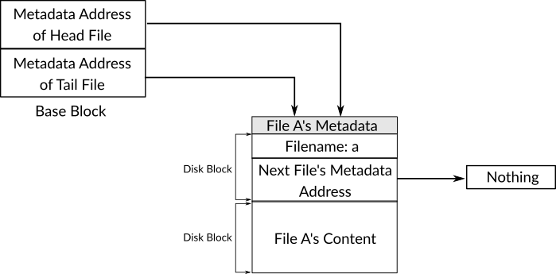
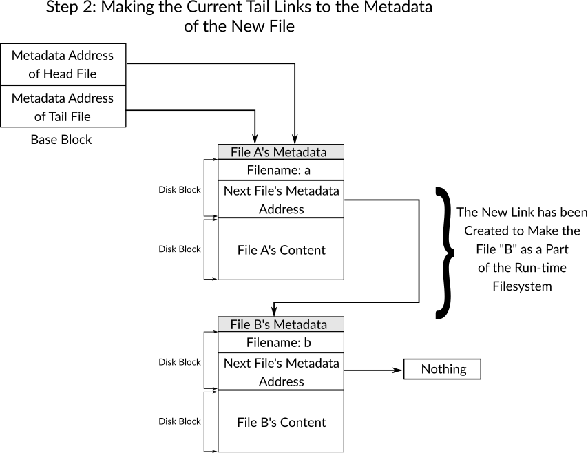
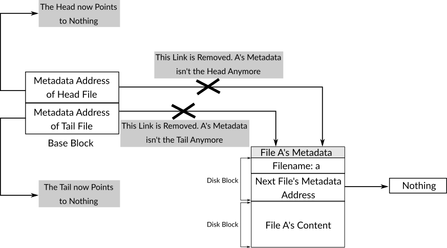
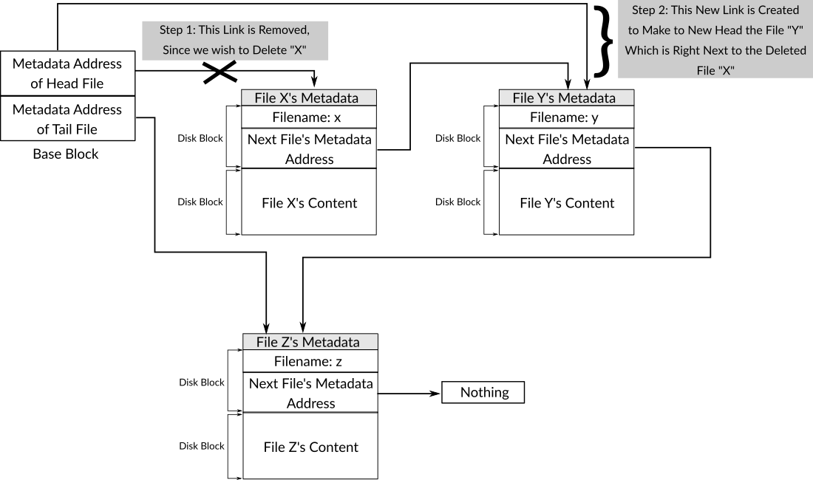
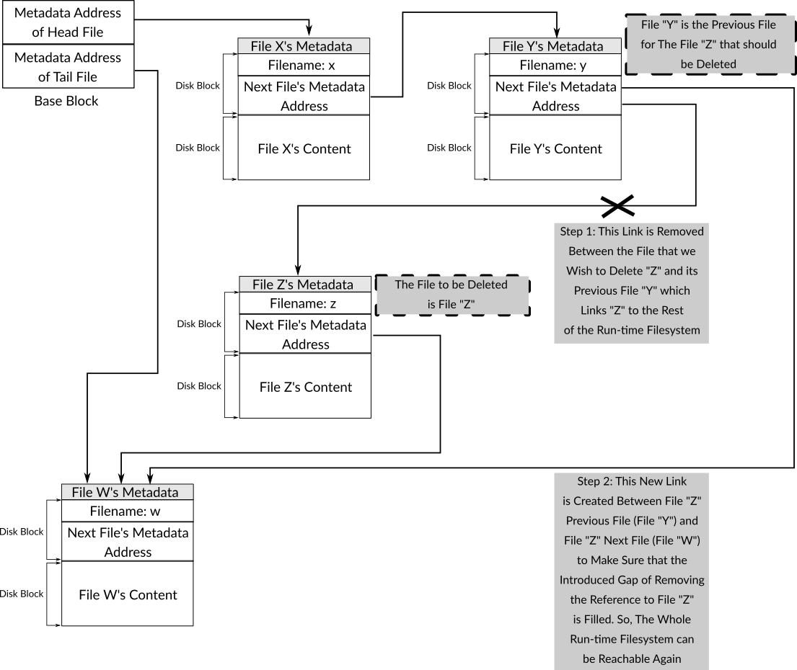
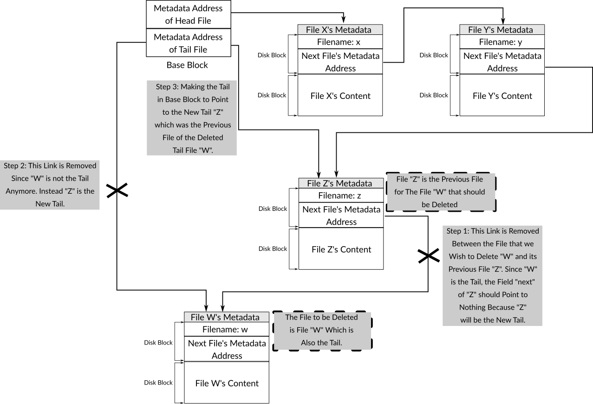

# Chapter 6: Filesystems {#ch-filesystems}

## Introduction
Given that both the processor and the main memory are resources in the system, until this point, we've seen how a kernel of an operating system works as a resource manager. The 539kernel manages these resources ^[Incompletely of course, to keep the 539kernel as simple as possible, only the basic parts of resource management were presented.] and provides them to the different processes in the system.

Another role of a kernel is to provide a way to communicate with external devices, like the keyboard and the hard disk. *Device drivers* are the way of realizing this role of a kernel. The details of the external devices and how to communicate with them are low-level and may be changed at any time. The goal of a device driver is to communicate with a given device by using the device's own language^[The word *language* here is a metaphor, it doesn't mean a programming language.] on behalf of any component of the system (e.g. a process) that would like to use the device. Device drivers provide an interface which can be called by the other system components in order to tell the device something to do. We can consider this interface as a library that we use in normal software development. In this way, the low-level details of the device are hidden from the other components and whenever these details change only the code of the device driver should change in response, the interface can be kept to not affect its users. Also, hiding the low-level details from the driver's user can ensure the that the driver is easy to use.

The matter of hiding the low-level details by using a higher-level interface is very important and can be found, basically, everywhere in computing and the kernels are not an exception to this rule. Of course, there is virtually no limit of wrapping previous lower-level concepts by providing higher-level concepts. This means that something that provides what we consider a high-level concept still can be used to build something even higher-level. Besides the previous example of device drivers, one obvious example where a kernel fulfills the role of hiding the low-level details by providing something higher-level, in other words, by providing an *abstraction*, is a filesystem which provides the well-known *file* abstraction.

In this chapter we are going to cover the two topics of device drivers and filesystems by using the 539kernel. As you may recall, it turned out that accessing the hard disk is an important aspect of virtual memory. So, to be able to implement virtual memory, the kernel itself needs to be able to access the hard disk which makes it an important component in the kernel. Thus, we're going to implement a device driver that communicates with the hard disk in this chapter. After getting the ability to read from the hard disk or to write to it, we can explore the idea of providing abstractions by the kernel by writing a filesystem that uses the hard disk device driver and provides a higher-level view of the hard disk that we're all familiar with instead of the physical view of the hard disk which has been described previously in chapter \ref{ch-bootloader}. The final result of this chapter will be the version `NE` of the 539kernel.

## ATA Device Driver
Needless to say that the hard disks are devices that are very commonly used as secondary storage. There are lots of manufacturers that manufacture hard disks and sell them, imagine for a moment that each hard disk from a different manufacturer would use its own way to communicate with the software, that is, the method `X` would be used to be able to communicate with hard disks from manufacturer `A` while the method `Y` would be used with hard disks from manufacturer `B` and so on. Given that there are too many manufacturers, this would be a nightmare. Each hard disk would need its own device driver which talks a different language from the other hard disk device drivers.

Fortunately, this isn't the case, at least not for hard disks. For a situation like this, standards come to the rescue. A manufacturer may design the hard disk hardware in any way, but when it comes to the part of the communication between the hard disk and the outside world, a standard can be used, so, any device driver that implements a given standard will be able to communicate with any hard disk from any manufacturer as long the the manufacturer implements the same standard. There are many well-known standards that are related to hard disks, *small computer system interface* (SCSI) is one of them, another one is *advanced technology attachment* (ATA), another well-known name for ATA is *Integrated Drive Electronics* (IDE). The older ATA standard is now known as Parallel ATA (PATA) while the newer version of ATA is known as Serial ATA (SATA). Because ATA is more common in personal computers, while SCSI is more common in servers, we're going to focus on ATA here and write a device driver for it.

As with the PIC which has been discussed in chapter \ref{ch-progenitor}, ATA hard disks can be communicated with by using port-mapped I/O communication through the instructions `in` and `out`. But before discussing the ATA commands that let us issue read and write requests to the hard disk, let's write two routines in assembly that can be used used by C functions to perform the functionality of the instructions `in` and `out` from C code.

As you may recall, the instruction `out` is used to write some bytes to a given port number, so, if we know the port number that a device (e.g. a hard disk) receives commands from, we can use the instruction `out` to write a command to the device's port. On the other hand, the instruction `in` reads data from a given port, for example, sometimes after we've sent a command to a device, it responds by writing something on a specific port, the instruction `in` can be used to read this value.

The assembly code of both routines that we're going to define next should reside in `starter.asm` anywhere between `bits 32` and the beginning of the `start_kernel` routine. The following snippet shows the code of `dev_write` whose prototype in C is `dev_write( int port, int cmd )`, this function can be used by the C kernel code to write to a given port:

```{.asm}
dev_write:
	; Part 1
	push edx
	push eax
	
	; Part 2
	xor edx, edx
	xor eax, eax
	
	; Part 3
	mov dx, [esp + 12]
	mov al, [esp + 16]
	
	; Part 4
	out dx, al
	
	; Part 5
	pop eax
	pop edx
	
	ret
```

The core part of this routine is part four which contains the instruction `out` that sends the value of `AL` to the port number which is stored in `DX`. Because we are using these two registers ^[Which are, as you know, the lower `16-bit` parts of the registers `EAX` and `EDX` respectively.], we push their previous values onto the stack which is performed in the first part of the routine. Pushing the previous values of these registers lets us restore them easily after the routine finishes its work, this restoration is performed in the fifth part of the routine right before returning from it. This is an important step to make sure that when the routine returns, the environment of the caller will be same as the one before calling the routine.

After storing the previous values of `EAX` and `EDX` we can freely use these register, so, the first step after that is to clear their previous values by setting the value `0` to both of them. As you can see, we have used the `xor` instruction and both operands of it reference the same register (hence, value) that we wish to clear. This is a well-known way in assembly programming to clear the value of a register ^[To our best knowledge it has better performance than the intuitive way of using `mov` with a constant value.]. After that, we can move the values that have been passed to the routine as parameters to the correct registers to be used with the `out` instruction. This is performed in the third part of the routine ^[You may notice that we've omitted the epilogue of a routine that creates a new stack frame. This decision has been made to make the matters simpler and shorter, you are absolutely free to follow the calling convention and most probably following it is a better practice.].

Beside `dev_write`, we need to define another routine called `dev_write_word` which is exactly the same as `dev_write` but writes a word (`2` bytes) instead of a byte to a port. The following snippet shows the code of this routine:

```{.asm}
dev_write_word:
	push edx
	push eax
	
	xor edx, edx
	xor eax, eax

	mov dx, [esp + 12]
	mov ax, [esp + 16]
	
	out dx, ax
	
	pop eax
	pop edx
	
	ret
```

As you can see, the only difference between `dev_write` and `dev_write_word` is that the former uses the register `AL` (`8-bit`) as the second operand of `out` while the latter uses `AX` (`16-bit`) instead, so, a word can be written to the port.

The following snippet shows the code of the routine `dev_read` whose prototype in C can be written as `char dev_read( int port )` which uses the instruction `in` to read data from a given port to return it to the caller:

```{.asm}
dev_read:
	push edx
	
	xor edx, edx
	xor eax, eax
	
	mov dx, [esp + 8]
	
	in ax, dx
	
	pop edx
	
	ret
```

For the same reason of restoring the previous environment when returning to the caller, the routine pushes the value of `edx` onto the stack, then both `EDX` and `EAX` are cleared since they will be used by the instruction `in`. After that, the value of the passed parameter which represents the port number that the caller wishes to read from is stored in `DX`. Finally, `in` is called, the result is stored in `AX`. Since the first operand of `in` is `AX` and not `AL`, a **word** will be read from the port and not a single byte. The decision of using `AX` instead of `AL` was made here because of our needs as you will see later, if you need to read just one byte for some reason you can define another routine for that. Finally, the previous value of `EDX` is restored and the routine returns.

You may ask, why did we only store and restore the previous value of `EDX` and not of `EAX` which was also used in the code of the routine? The reason is that `dev_read` is a function that returns a value, and according to the calling convention the returned value from a function should be stored in the register in `EAX`. So, the value of `EAX` is intended to be changed when we return to the caller. Therefore, logically, it would be a mistake to restore the the previous value of `EAX` when `dev_read` returns.

Because the ultimate goal of defining both, `dev_write` and `dev_read`, is to make them available to be used in C code, the lines `global dev_write`, `global dev_write_word` and `global dev_read` should be added at the beginning of `starter.asm` after `global enable_paging`.

### The Driver
One ATA bus on the computer's motherboard makes it possible to attach two hard disks to the system, one of them is called the master drive which is the main one that the computer boots from, the other disk is known as the slave drive. Usually, a computer comes with two ATA buses instead of just one, which means up to four hard disks can be attached to the computer. The first one of those buses is known as the primary bus while the second one is known as the secondary bus.

Terms that combine a bus name with a device name are used to specify exactly which device is being discussed. For example, primary master means the master hard disk that is connected to the primary bus while secondary slave means the slave hard disk which is connected to the secondary bus.

The port numbers that can be used to communicate with the devices that are attached to the primary bus start from `0x1F0` and end with `0x1F7`, each one of these ports has its own functionality. The port numbers from `0x170` to `0x177` are used to communicate with devices that are attached to the secondary bus, so, there are eight ports for each ATA bus.

For the sake of simplicity, our device driver is going to assume that only a primary master is attached in the system and all read and write requests should be sent to this primary master. Therefore, our device driver uses the port number `0x1F0` as the base port to send the commands via the PIC.

You may ask, why are we calling this port number a base port? As you know, all of the following port numbers are valid to communicate with the primary ATA bus: `0x1F0`, `0x1F1`, `0x1F2`, `0x1F3`, `0x1F4`, `0x1F5`, `0x1F6`, `0x1F7`, thus, we can add any number from `0` through `7` to the base port number of the primary bus `0x1F0` to get a correct port number. The same holds true with the secondary ATA bus whose base port number is `0x170`. So, we can define the base port as a macro (or even a variable) as we will see in our device driver, then we can use this macro by adding the values `0` through `7` to it to get a specific port. The advantage of doing so is the simplicity of changing the value of the base port to another port without the need of changing the code itself.

Before starting with the implementation of the driver, let's create two new files: `ata.h` and `ata.c` which will contain the code of the ATA device driver which provides an interface for the rest of the kernel to write to and read from a disk. The following snippet shows the contents of `ata.h`, the details of the functions will be discussed in the next subsections:

```{.c}
#define BASE_PORT 0x1F0
#define SECTOR_SIZE 512

void wait_drive_until_ready();

void *read_disk( int );
void write_disk( int, short * );

void *read_disk_chs( int );
void write_disk_chs( int, short * );
```

#### Addressing Mode
Just like the main memory, the hard disks use addresses to read the data that is stored in a specific area of the disk. The same is applicable for the write operation, the same address that is used to read some data from a specific area can be used to write to the same specific area. There are two schemes of hard disk addresses, the older one is known as *cylinder-head-sector* addressing (`CHS`) while the newer one which more dominant nowadays is known as *logical block addressing* (`LBA`).

In chapter \ref{ch-bootloader} we've covered the physical structure of hard disks and we know from that discussion that the data is stored in small blocks known as sectors. Also, there are tracks that consist of a number of sectors, and finally, there are heads that should be positioned on a specific sector to read from it or to write to it. The `CHS` scheme uses these concepts of the physical structure of hard disks, the address of a given sector on the hard disk should be composed by combining the three numbers together, the cylinder (track) that this sector resides on, the sector that we would like to access and the head that is able to access this sector. However, this scheme is obsolete now and `LBA` is used instead.

In `LBA`, a logical view of a hard disk is used instead of the physical view. This logical view states that the hard disk is composed of a number of logical blocks with a fixed size, say, *n* bytes. These blocks are contiguous in a similar way as the main memory and to reach any block you can use its own address. The addresses start from `0`, the block right after the first one has the address `1` and so on. As you can see, addressing in `LBA` is more like the addressing in the main memory, the main difference here being that in modern computers each address of the main memory points to a byte in memory while an address in `LBA` points to a block which can be a sector (`512` bytes) or even bigger.

#### Reading from the Disk
In this subsection we are going to implement both `read_disk_chs` and `read_disk` which send commands to an ATA hard disk via the available ports in order to read a sector/block from the disk. The first one of those functions uses `CHS` scheme while the second one uses the `LBA` scheme. In the following discussions, we're going to use the symbol `base_port` to indicate the base port of one of the ATA ports. In our case, the base port is always `0x1F0` since we're going to use the primary bus in our device driver, but our discussion is applicable to any ATA bus with any base port number.

To issue a read command the value `0x20` should be sent to `base_port + 7`, but before doing that, a number of values should be set in the other ports in order to specify the address that we would like to read from. The following sections describe the purpose of these ports.

In `base_port + 2` the number of sectors/blocks that we would like to read in this operation should be set.

The value that should be written to `base_port + 6` specifies more than one thing, bit `6` of this value specifies whether we are using `CHS` or `LBA` addressing in the current read request. When the value of this bit is `0` then `CHS` is being used while the value of `1` means that `LBA` is being used. The bits `5` and `7` of this value should always be `1`. The bit `4` specifies the drive that we would like to read from, the value `0` is used for the master drive while `1` is used for the slave drive.

In the case that we are using `CHS`, the first four bits (`0` to `3`) of this value are used to specify the head while in the case that we are using `LBA`, these bits store a part of the `LBA` address, the stored part goes from bit `24` to bit `27`. When the current addressing mode is `CHS`, the sector number that we would like our read operation to start from should be sent to `base_port + 3`, the low part of the cylinder number should be sent to `base_port + 4` and the high part of the cylinder number should be sent to `base_port + 5`. The following two tables summarize the parameters to the read command when the addressing mode is `CHS`:

| Port Number   | Purpose (in CHS)                                                                                              |
|---------------|----------------------------------------------------------------------------------------------------------------------------------|
| base_port + 2 | Number of Sectors to Read                                                                                                        |
| base_port + 3 | The Sector Number to Read From                                                                                                   |
| base_port + 4 | Lower Part of the Cylinder Number                                                                                                |
| base_port + 5 | Higher Part of the Cylinder Number                                                                                               |
| base_port + 7 | Command Port. Read Command: 0x20                                                                                                 |

| Port Number   | Bit(s) | Purpose (in CHS)                     |
|---------------|--------|--------------------------------------|
| base_port + 6 | 0-3    | The Head                             |
|               | 4      | Drive to Use (0 = Master, 1 = Slave) |
|               | 5      | Always 1                             |
|               | 6      | Addressing Mode (0 for CHS)          |
|               | 7      | Always 1                             |

Once the read command is issued with the right parameters passed to the correct ports, we can read the value of `base_port + 7` to check if the disk has finished the reading operating or not by reading the eighth bit (bit `7`) of that value. The value `1` of this bit means the drive is still busy, once it becomes `0` means that the operation was completed.

When the reading operation is completed successfully, the data is available on `base_port` which means we need to read from it and put the requested data into the main memory. The following snippet shows the code of `read_disk_chs` that should reside in `ata.c`. Don't forget to include `ata.h` when you create `ata.c`:

```{.c}
void *read_disk_chs( int sector )
{
	// Part 1
	
	dev_write( BASE_PORT + 6, 0x0a0 );
	dev_write( BASE_PORT + 2, 1 );
	dev_write( BASE_PORT + 3, sector );
	dev_write( BASE_PORT + 4, 0 );
	dev_write( BASE_PORT + 5, 0 );
	dev_write( BASE_PORT + 7, 0x20 );
	
	// ... //
	
	// Part 2
	wait_drive_until_ready();
	
	// ... //
	
	// Part 3
	
	short *buffer = kalloc( SECTOR_SIZE );
	
	for ( int curr_word = 0; curr_word < ( SECTOR_SIZE / 2 ); curr_word++ )
		buffer[ curr_word ] = dev_read( BASE_PORT );
	
	return buffer;
}
```

In the first part of `read_disk_chs` we set the required values to the appropriate ports as we've described above. In the port `base_port + 6` we set that the drive is `0` and the head is `0`, also, we set that the addressing mode that we're currently using is `CHS`. In port `base + 2` we set that we would like to read one sector, that is, the function `read_disk_chs` reads `512` bytes from disk with each call. In port `base_port + 3` we set the sector number that we would like to read, as you can see, this number is passed via the parameter `sector`, so, the caller can specify the sector that should be read. In both `base_port + 4` and `base_port + 5` we specify the cylinder that we would like to read from, which is cylinder `0`. Finally, we issue a read request to the ATA bus by writing `0x20` to `base_port + 7`. For the sake of simplicity, we have used fixed values for a number of parameters here, in real situations, those fixed values should be more flexible. However, using `LBA` will provide us more flexibility with the simplicity that we are interested in.

The second part of `read_disk_chs` calls the function `wait_drive_until_ready` which makes sure that the code after calling it won't be executed until the device finishes its work. The following snippet shows the code of this function:

```{.c}
void wait_drive_until_ready()
{
	int status = 0;
	
	do
	{
		status = dev_read( BASE_PORT + 7 );
	} while ( ( status ^ 0x80 ) == 128 );
}
```

The function `wait_drive_until_ready` reads the value of the port `base_port + 7` which is going to contain the status of the drive. As we mentioned earlier, the eighth bit (bit `7`) of this value indicates whether the drive is busy or not. With each iteration of the loop, the function reads this value and checks whether the value of the eighth bit is `1` by using a bitwise operation. If it's the case, that means the drive is still busy in completing the requested operation (reading operation in our current case), so, we need to wait for it until it finishes. We spend this time by reading the value of the port and checking the eighth bits over and over again until the drive finishes. This technique of checking a device's status over and over again until it finishes an operation is known as *busy waiting*.

When the read operation finishes, we can read the target content word by word ^[The fact that we need to read a word here instead of a byte is the reason of using the register `AX` instead of `AL` as the first operand for the `in` instruction in the function `dev_read`.] from the base port. That's the job of the third part of `read_disk_chs` which reads a word on each iteration of the loop and stores the read value in a buffer that we dynamically allocate from the kernel's heap.

We've used the type `short` for the variable `buffer` because the size of this type in the `32-bit` architecture is `2` bytes, that is, a word. In the condition of the `for` loop we used `curr_word < ( SECTOR_SIZE / 2 )` instead of `curr_word < SECTOR_SIZE` due to the fact that we are reading a word (two bytes) in each iteration instead of a byte. Finally, the memory address which `buffer` points to, is going to contain the sector that we've just read from the disk, this memory address will be returned to the caller.

Now, we can turn our attention to the other read function `read_disk` which uses the `LBA` scheme instead of `CHS`. In fact, this new function will be very similar to `read_disk_chs`, the main differences will be in some values that we pass to the ports of the ATA bus. In the `LBA` scheme, `base_port + 6` should be changed to indicate that the scheme that we are using is `LBA`. As we've mentioned before, we can do that by setting the bit `6` to the value `1`. The other difference in this port value is that the bits `0` to `3` should contain the bits `24` to `27` of the logical block address that we would like to read from. The other parts of the address are divided to the following ports: `base_port + 3` contains bits `0` to `7` of that address, `base_port + 4` contains bits `8` to `15`, `base_port + 5` contains bits `16` to `23`. Both, the port `base_port + 2` and the port `base_port + 7` stay the same. The following two tables summarize the parameters of the read command when `LBA` is used:

| Port Number   | Purpose (in LBA)                                                                                                                               |
|---------------|-------------------------------------------------------------------------------------------------------------------------------------------------------------------|
| base_port + 2 | Number of Blocks to Read                                                                                                                                          |
| base_port + 3 | Bits 0-7 from the Logical Block Address                                                                                                                           |
| base_port + 4 | Bits 8-15 from the Logical Block Address                                                                                                                          |
| base_port + 5 | Bits 16-23 from the Logical Block Address                                                                                                                         |
| base_port + 7 | Command Port. Read Command: 0x20                                                                                                                                  |

| Port Number   | Bit(s) | Purpose (in CHS)                          |
|---------------|--------|-------------------------------------------|
| base_port + 6 | 0-3    | Bits 24-27 from the Logical Block Address |
|               | 4      | Drive to Use (0 = Master, 1 = Slave)      |
|               | 5      | Always 1                                  |
|               | 6      | Addressing Mode (1 for LBA)               |
|               | 7      | Always 1                                  |

The function `read_disk` receives a parameter named `address` instead of `sector`, that is, the logical block address that the caller would like to read the data from. By using bitwise operations the value of this parameter can be divided into the described parts to be passed to the appropriate ports. The rest of `read_disk` is exactly the same as `read_disk_chs`. To not use too much space in the book, the following snippet shows only the start of the new function, the only part that is different from `read_disk_chs`:

```{.c}
void *read_disk( int address )
{
	dev_write( BASE_PORT + 6, ( 0x0e0 | ( ( address & 0x0F000000 ) >> 24 ) ) );
	dev_write( BASE_PORT + 2, 1 );
	dev_write( BASE_PORT + 3, address & 0x000000FF );
	dev_write( BASE_PORT + 4, ( address & 0x0000FF00 ) >> 8 );
	dev_write( BASE_PORT + 5, ( address & 0x00FF0000 ) >> 16 );
	dev_write( BASE_PORT + 7, 0x20 );
```

#### Writing to Disk
In both `CHS` and `LBA`, the write operation uses ports exactly in the same way as the read operation, with two differences. Firstly, the command number to issue a write request is `0x30` which should be written to `base_port + 7` after setting all the values to the other ports. Secondly, after the drive becomes ready to write the data to the requested location, we should write word after word to `base_port` until we're done. This is performed by calling the routine `dev_write_word` which uses the instruction `out` to perform this job. Without further ado, what follows are the two functions that write to disk, `write_disk_chs` which uses `CHS` to write to the disk, and `write_disk` that uses `LBA`. Both of them receive a parameter called `buffer` which is a pointer to the data that we would like to write to the disk. You can see in the following implementation that `wait_drive_until_ready` is called twice, the first time after setting all the parameters and issuing the write command, the second time after requesting to write the words of the buffer into the disk in order to make sure that the write function doesn't return before the disk finishes the write operation:

```{.c}
void write_disk_chs( int sector, short *buffer )
{
	dev_write( BASE_PORT + 6, 0x0a0 );
	dev_write( BASE_PORT + 2, 1 );
	dev_write( BASE_PORT + 3, sector );
	dev_write( BASE_PORT + 4, 0 );
	dev_write( BASE_PORT + 5, 0 );
	dev_write( BASE_PORT + 7, 0x30 );
	
	wait_drive_until_ready();
	
	for ( int curr_word = 0; curr_word < ( SECTOR_SIZE / 2 ); curr_word++ )
		dev_write_word( BASE_PORT, buffer[ curr_word ] );
	
	wait_drive_until_ready();
}

void write_disk( int address, short *buffer )
{
	dev_write( BASE_PORT + 6, ( 0x0e0 | ( ( address & 0x0F000000 ) >> 24 ) ) );
	dev_write( BASE_PORT + 2, 1 );
	dev_write( BASE_PORT + 3, address & 0x000000FF );
	dev_write( BASE_PORT + 4, ( address & 0x0000FF00 ) >> 8 );
	dev_write( BASE_PORT + 5, ( address & 0x00FF0000 ) >> 16 );
	dev_write( BASE_PORT + 7, 0x30 );
	
	wait_drive_until_ready();
	
	for ( int curr_word = 0; curr_word < ( SECTOR_SIZE / 2 ); curr_word++ )
		dev_write_word( BASE_PORT, buffer[ curr_word ] );
	
	wait_drive_until_ready();
}
```

## Filesystem
Until now, we've seen multiple examples of presenting a logical higher-level view of something that is low-level, another example of that is a filesystem. A filesystem is a higher-level view of a storage device, this higher-level view makes it easier for human users (and also the code) to use storage devices. Take hard disks as an example, imagine we'd use them based on their low-level interface that we've discussed in this chapter. It would really be too hard for us humans to remember what the logical block address is of some data that we need to fetch, also, it would be even harder to remember which blocks of the hard disk are free and which of them are in use in order to store new data. As an alternative, we can build a logical view of the hard disk functionality based on this low-level method to make it easier for human users to use the hard disk and hide the complicated low-level details of hard disks.

Filesystems provide a well-known abstraction called *file* which is a sequence of bytes that has a name and is reachable by using this name. By providing this abstraction, it's much easier for a human or an application to use the hard disk to store and retrieve data. Besides the file abstraction, a filesystem may provide more features, for example, directories (or folders) are usually provided by filesystems in order to let users organize their files in a hierarchical way.

To be able to implement the file abstraction we need a way to maintain the list of current files stored in the filesystem and their locations on the disk. Due to that, specific filesystems usually use some sort of a data structure to maintain the information about the files in a given system, that is, the files' *metadata* ^[The term metadata means data about data]. This data structure is stored on the disk and is interpretable by a kernel that has an implementation for this filesystem. By loading this data structure from the disk and interpreting it correctly, the kernel can present, read and write the files and directories on the disk the way they were stored previously.

The meaning of the term filesystem may differ based on the context. The first meaning of this term which we meant above is a subsystem (component) of an operating system that implements the rules and data structures required to understand how a filesystem stores data on disk to be able to manage the files and directories on a disk that uses this filesystem. The other meaning that you may encounter more often in system administration contexts is the list of all files and directories that the users created on a specific filesystem. In our next discussions I'm going to use the term *filesystem* to mean the former definition, while I'll use the term *run-time filesystem* to mean the latter definition. Also, when the term *address* is used in the upcoming discussions, it means a logical block address.

As in programming languages, a filesystem may be divided into two parts: A design and an implementation. The design of a filesystem tells us how this filesystem stores the information about the run-time filesystem, how the metadata is organized, which data structures are used to implement the functionality of the filesystem and so on ^[The design part of a programming language is the language specification.]. Of course, the design can be available in the form of a paper, a brilliant theoretical piece of work, but to realize this design, an implementation must be written that uses it ^[The implementation part of a programming language is the compiler or the interpreter.]. For example, a well-known filesystem is *FAT* (short for: file allocation table) which is an old filesystem that was first implemented in 1977 and is still in use nowadays. Because its design is available in form of a specification, anyone can write an implementation for it and make their kernel able to read a run-time filesystem that has been created by another operating system that uses FAT. The Linux kernel is an example of one of the kernels that have a FAT implementation. As an example of filesystem, we are going to design and implement the *539filesystem* in this section.

### The Design of the 539filesystem
The design of the 529filesystem contains many restrictions to make its implementation as simple as possible. Firstly, there may be only one directory on the run-time filesystem that uses the 539filesystem which is the root directory, all the files that are created by the user may only be stored in this directory and there is no way to create new directories. Secondly, the maximum size of a file is `512` bytes. And finally, when a file is created there is no way to modify it, its contents are written when it's created and that's it, no further modifications are allowed! I know, you may think that these restrictions are too harsh, I agree, but these restrictions help us in providing a very simple and elegant implementation of a real filesystem that can be extended easily to get rid of these restrictions.

The data structure that will be used to maintain the metadata of the run-time filesystem is the linked-list which is a simple data structure that is known for being slow when performing search operations but fast when doing insert operations. Its simplicity is the reason of choosing it for the 539filesystem, real modern filesystems use more complex data structures to improve the performance of the filesystem.

{#fig:539filesystem_overview width=75%}

In the 539filesystem, the block that has the address `100d` on the disk is known as the *base block*, from this block we can reach the whole run-time filesystem. The base block is divided into two parts, the size of each one of them is `4` bytes. The first part is the address of the metadata of the first file that has been created on the run-time filesystem, that is, the *head file* ^[In linked-list data structure's terms: the head.] while the second part is the address of the metadata of the last file that has been created on the run-time filesystem, that is, the *tail file* ^[In linked-list data structure's terms: the tail.].

Each file has its own metadata that contains the file's name and the *`next` field* which stores the metadata address of the next file in the filesystem. The length of the filename is `256` bytes and the size of the `next` field is `4` bytes. When there is no next file, the value `0` is stored in the `next` field of the last file's metadata, that is, the tail file.

It should be obvious now how can we reach all files in a run-time filesystem that uses the 539filesystem. Starting from the base block we get the metadata address of the head file and by using the `next` field from this metadata we can reach the metadata of the next file and the process continues until we reach the tail file.

The metadata of each file is stored in the block directly followed by the block that contains the contents of the file which. The contents are limited to one block only meaning that the maximum size of the contents of a file is `512` bytes which corresponds to the block size ^[In real-world situations, allocating a whole block for the metadata that is only `260` bytes long can be considered as a waste of space. One of the goals of real filesystems is to use as little space as possible for the maintenance of the run-time filesystem's structure.]. For example, if the metadata of a file `A` is stored at the address `103d`, then the contents of this file are stored at the address `104d`. By using this design, the basic functionalities of a filesystems can be provided. Figure @fig:539filesystem_overview shows an overview of the 539filesystem's design with four stored files on the run-time filesystem, the files `x`, `y`, `z` and `w`.

### The Implementation of the 539filesystem
Before getting started with the implementation of the design proposed in the previous section, let's define two new files: `str.h` and `str.c` which contain string related functions that can be useful when we write our filesystem. Two functions will be implemented in `str.c`, they are `strcpy` which copies a string from one location to another, and `strcmp` which compares two strings, if they are equal then `1` is returned, otherwise `0`. There is no need to explain the details of the code of these two functions since they depend on the normal way of working with strings in C. The following snippet shows the contents of `str.h`:

```{.c}
void strcpy( char *, char * );
int strcmp( char *, char * );
```

The following snippet shows the contents of `str.c`:

```{.c}
#include "str.h"

void strcpy( char *dest, char *src )
{
	int idx = 0;
	
	while ( *src != '\0' )
	{
		dest[ idx ] = *src;
		
		src++;
		idx++;
	}
}

int strcmp( char *str1, char *str2 )
{
	while ( *str1 != '\0' )
	{
		if ( *str1 != *str2 )
			return 0;
		
		str1++;
		str2++;
	}
	
	if ( *str2 != '\0' )
		return 0;
	
	return 1;
}
```

Now we can start implementing the 539filesystem. The first step is, as usual, to create the files that hold the functions related to our filesystem: `filesystem.h` and `filesystem.c`. The following snippet shows the contents of `filesystem.h`:

```{.c}
#define BASE_BLOCK_ADDRESS 100
#define MAX_FILENAME_LENGTH 256

typedef struct
{
	int head, tail;
} base_block_t;

typedef struct
{
	char filename[ MAX_FILENAME_LENGTH ];
	int next_file_address;
} metadata_t;

base_block_t *base_block;

void filesystem_init();
void create_file( char *, char * );
char **list_files();
char *read_file( char * );
void delete_file( char * );

// Auxiliary Functions
metadata_t *load_metadata( int );
int get_address_by_filename( char * );
int get_prev_file_address( int );
int get_files_count();
```

First we define two macros, `BASE_BLOCK_ADDRESS` and `FILENAME_LENGTH`. The first one is the address of base block on the disk, as we've mentioned earlier, this address is `100d`. The second one is the maximum length of a filename in the 539filesystem, and we mentioned earlier that this length is `256` characters.

Then we define two structures as types: `base_block_t` and `metadata_t`. Based on our discussions on the 539filesystem's design, you may have noticed that `base_block_t` represents the base block. It has two fields, each one of them has the size of `4` bytes, the first one is called `head` and the second one is called `tail`. The type `metadata_t` represents the metadata of a file. As we described before, it has two fields, the first one is the filename and the second one is the metadata address of the next file. These two structures are based on the linked-list data structure, and we are going to use them to load the data that they represent from the disk, manipulate them while they are in the main memory, then write them back to the disk in order to make the run-time filesystem persistent.

Then the global variable `base_block` is defined, which is the memory address that contains the base block after loading it from the disk. As we've said, this loaded copy is the one that we are going to update when the user performs a transactional operation on the run-time filesystem such as creating a new file for example.

After including `filesystem.h` in `filesystem.c` the first function that we are going to implement is `filesystem_init` which is an initializer that will be called once the kernel starts. Its implementation is very straightforward, it is going to use the ATA device driver to read the base block from the disk into the main memory and store the memory address of this loaded data in the global variable `base_block`, shown in the following snippet:

```{.c}
void filesystem_init()
{
	base_block = read_disk( BASE_BLOCK_ADDRESS );
}
```

We need to include `filesystem.h` in `main.c` and call function `filesystem_init` by putting the line `filesystem_init();` in `kernel_main` function of `main.c` after the line `scheduler_init();`. The rest of the functions will be discussed in the following sub-sections.

#### Creating a New File
Let's begin with the function `create_file`, we mentioned before that there is no separate write operation in the 539filesystem, instead, the contents of a new file are written in the same operation that creates a new file. The `create_file` operation must first find a disk address that the new file and its metadata should be stored in. Of course, in real-world situation, the filesystem should be sure that this disk address is free and doesn't contain a part of another file. After picking the disk address for this new file, the metadata of the file should be stored in the block that this address points to, and in the next block the contents of this file should be stored. The metadata of the new file can be initialized by using the type `metadata_t` and after that it can be stored on the disk by using the ATA device driver.

Apart of writing the metadata and the contents of the file on the disk, creating a new file in the 539filesystem is equivalent to inserting a new item in a linked-list. For this, the base block needs to be modified to make sure that the new file is reachable later. To do that, the metadata address of the new file should replace the tail in the base block, that is, the metadata address that was the tail before creating the new file won't be the tail anymore, it'll become a normal item in the list that was once the tail. After the change, it can be reached via the `next` field of the file before it. The `next` field of the now second-to-last file should be updated to point to the newly created file, and the tail in base block should be updated to point to the newly created file. There are also a few more subtle cases when updating the base block that will be discussed while we write the code of `create_file`. Let's start with the first part of the function:

```{.c}
void create_file( char *filename, char *buffer )
{
	int metadata_lba = ( base_block->head == 0 ) ? BASE_BLOCK_ADDRESS + 1 : base_block->tail + 2;
	int file_lba = metadata_lba + 1;
	
	metadata_t *metadata = kalloc( sizeof( metadata_t ) );
	
	metadata->next_file_address = 0;
	
	int currIdx;
	
	for ( currIdx = 0; *filename != '\0' && currIdx < MAX_FILENAME_LENGTH - 1; currIdx++, filename++ )
		metadata->filename[ currIdx ] = *filename;
	
	metadata->filename[ currIdx ] = '\0';
	
	write_disk( metadata_lba, metadata );
	write_disk( file_lba, buffer );
```

When the value of the head in the base block is `0`, it means that there are no files at all in the run-time filesystem. When `create_file` is called in this situation, that means the file that the caller is requesting to create is the first file in the run-time filesystem, the metadata of this first file can be simply stored in the block right after the base block. In `create_file` this fact is used to pick the disk address for the metadata of the new file. This address is then stored in the local variable `metadata_lba` which is short for "metadata logical block address". Figure @fig:create_file_empty_case shows the state of the 539filesystem after creating the first file `A` on the run-time filesystem.

{#fig:create_file_empty_case width=65%}

In case that the run-time filesystem is not empty, that is, the value of `head` is not `0`, the tail field of the base block can be used to pick the metadata address of the new file. As we know, the tail field contains the metadata address of the last file that has been added to the run-time filesystem, and the contents of this file are stored at the disk address `tail + 1`, which means `tail + 2` is a free block that can be used to store new data ^[This is ensured since the 539filesystem stores the files in order, so, there will be no files after the tail unless it is a deleted file which can be overwritten and causes no data loss.], so we choose this address for the new metadata in this case. After that, the disk address for the new contents is calculated by simply adding `1` to the disk address of the new metadata, the address of the contents is stored in the local variable `file_lba`.

After deciding the disk addresses of the new metadata and the file contents, we start by creating the metadata of the file to store it later on the disk. As you can see in the code, we allocate some space in the kernel's heap for the new metadata by using the size of the type `metadata_t`, after this allocation, we can use the local variable `metadata` to fill the fields of the new file metadata. First, we set the value of the `next` field to `0`, because, as we mentioned earlier, this new file will be the tail file which means there is no file after it. Then, we copy the filename which is passed as a parameter `filename` to the filename field of the metadata. In case the passed filename's length is less than the maximum length, the whole filename is copied, otherwise, only the maximum allowed number of characters of the passed filename are copied and the rest are simply ignored. The final step to create the new file is to write the metadata and the file contents at the right addresses on the disk. This is done in the last two lines which use the ATA device driver. The following snippet shows the next and final part of `create_file` which updates the base block depending on the current state of the run-time filesystem:

```{.c}
	if ( base_block->head == 0 )
	{
		update_base_block( metadata_lba, metadata_lba );
	}
	else
	{
		metadata_t *tail_metadata = load_metadata( base_block->tail );
		
		tail_metadata->next_file_address = metadata_lba;
		
		write_disk( base_block->tail, tail_metadata );
		update_base_block( base_block->head, metadata_lba );
	}
} // End of "create_file"
```

When the run-time filesystem is empty, that is, the value of `head` in the base block is `0`, then the new file that we are creating will be both the head and the tail file. As you can see, in the block of the `if` statement that checks whether `head` equals `0` or not, the not yet defined function `update_base_block` is used, this function updates the values of `head` and `tail` of the base block and writes these changes to the permanent copy of the base block on the disk. The disk address of the new file's metadata is simply set as head and tail when `update_base_block` is called in this case.

The `else` case is `true` when the run-time filesystem isn't empty, that is, the value of `head` isn't `0`. In this case we need to update the disk address of the tail in the base block to make the new file the new tail, furthermore, the `next` field of the previous tail, which isn't the tail anymore, should be updated to point to the metadata of the new file.

In the `else` case, the not yet defined function `load_metadata` is used to load the metadata of the previous tail by passing it the tail's the disk address from the base block `tail` field as a parameter. After that, the local variable `tail_metadata` will point to that loaded metadata of the tail, and by using the type `metadata_t` we can easily reach the values of the fields of the previous tail. You can see that we then change the value of the `next_file_address` field to the metadata address of the new file, then we write the modified structure to the disk and of course at the same location we loaded it from. Finally, the `tail` field is updated in the base block by calling `update_base_block` whose code we will present next. Figures @fig:create_file_not_empty_case_1, @fig:create_file_not_empty_case_2 and @fig:create_file_not_empty_case_3 show the steps needed to create a new file in the 539filesystem as described and implemented in the function `create_file`.

{#fig:create_file_not_empty_case_1 width=85%}

{#fig:create_file_not_empty_case_2 width=85%}

{#fig:create_file_not_empty_case_3 width=85%}

```{.c}
void update_base_block( int new_head, int new_tail )
{
	base_block->head = new_head;
	base_block->tail = new_tail;
	
	write_disk( BASE_BLOCK_ADDRESS, base_block );
}
```

It's a simple function, it receives the value of head and tail that we would like to set on the base block, then we update the copy of the base block is kept in main memory, and finally this updated version is written at the base block address on the disk to overwrite the old version. The following snippet shows the code of `load_metadata` which has been used in the `create_file` function:

```{.c}
metadata_t *load_metadata( int address )
{
	metadata_t *metadata = read_disk( address );
	
	return metadata;
}
```

It receives a disk address and assumes that the block which is presented by this address is a metadata block. It loads this metadata into the main memory by loading the contents of the block at the passed address from disk by using the device driver function `read_disk`. The following snippet shows how to use `create_file` to create a new file on the run-time filesystem:

```{.c}
char *data = kalloc( 512 );

strcpy( data, "The contents of the first file in the 539filesystem" );

create_file( "first_file", data );
```

#### Listing All Files
To list all files in the 539filesystem, the normal traversal algorithm for a linked-list can be used. In linked-lists, to traverse all items of a list you need to start with the head of the list, then to reach the second item of the list, the `next` field of the head can be used, and so on for the rest of the items in the linked-list. The `next` field is the component which links the items of the list with each other. You keep traversing the items until the tail of the list is reached. You can check whether the current item is the tail by checking its `next` field, in case its value is `0` (or usually in higher-level implementations `NULL`) then you know that the current item is the tail which means the list is over. Another way to check if the current item is the tail is by comparing its address with the one which is stored in the `tail` field of the linked-list anchor, in our case, the base block. The following snippet shows the code of the function `list_files` which uses the algorithm we just described, it returns an array of strings, each item of this array is a filename:

```{.c}
char **list_files()
{
	// Part 1
	
	if ( base_block->head == 0 )
		return 0;
	
	// Part 2
	
	char **list;
	
	list = kalloc( get_files_count() * sizeof( char * ) );
	
	// Part 3
	
	metadata_t *curr_file = load_metadata( base_block->head );
	
	int idx = 0;
	
	while ( 1 )
	{
		list[ idx ] = curr_file->filename;

		if ( curr_file->next_file_address == 0 )
			break;
		
		curr_file = load_metadata( curr_file->next_file_address );
		
		idx++;
	}
	
	return list;
}
```

The first part of `list_files` handles the case where the run-time filesystem is empty, so, it returns `0` to indicate that there are no files to list. In case that the run-time filesystem isn't empty, the function in the second part allocates memory in kernel's heap for the list of the filenames. As you can see, we have used a function named `get_files_count` to decide how many bytes we are going to allocate for this list. Its name is self-explanatory, this function returns the number of files in the run-time filesystem, its code will be presented in a moment. In the third part, the function is ready to traverse the list of file metadata which is stored on the disk and is reachable starting from the disk address which is stored in the `head` field of the base block.

Initially, the metadata of the head file is loaded into memory and can be accessed through the local variable `curr_file`, then, the loop is started. In the body of the loop, the filename from the current file metadata entry is appended to the result's variable `list`. In the first iteration of this loop the filename will be the one that belongs to the head file. After appending the filename of the current file to `list`, the function checks if the current file is the tail file by checking the value of the `next` field `next_file_address`, if it's `0` then the current file is the tail, so, the loop breaks and the result is returned to the caller. In case that the current file isn't the tail file, then the metadata entry of the next file is loaded by using the disk address which is stored in the `next_file_address` field of the current file. The current value of `curr_file` is replaced with the memory address that points to the metadata of the next file which will be used in the next iteration of the loop. The same procedure continues until the function reaches the tail which breaks the loop and returns the list to the caller. The following snippet shows the code of `get_files_count` that was used in `list_files` and, as mentioned earlier, returns the number of stored files:

```{.c}
int get_files_count()
{
	if ( base_block->head == 0 )
		return 0;
	
	int files_count = 0;
	
	// ... //
	
	metadata_t *curr_file = load_metadata( base_block->head );
	
	while ( 1 )
	{
		files_count++;
		
		if ( curr_file->next_file_address == 0 )
			break;
		
		curr_file = load_metadata( curr_file->next_file_address );
	}
	
	return files_count;
}
```

As you can see, it works in a similar way as `list_files`, the main difference is that `get_files_count` keeps track of the number of iterations to fetch the number of files instead of copying the filename of the current file to another list. The following snippet shows how to use `list_files`:

```{.c}
void print_fs()
{
	char **files = list_files();

	if (files == 0)
		return;

	for ( int currIdx = 0; currIdx < get_files_count(); currIdx++ )
	{
		print( "File: " );
		print( files[ currIdx ] );
		println();
	}
	
	print( "==" );
	println();
}
```

#### Reading a File
The function `read_file` reads the contents of a file by file name passed as the only parameter. Then, the address of a buffer that contains the contents of the requested file read from the disk is returned to the caller. Because the file size in 539filesystem is always `512` bytes, the function `read_disk` of the ATA device driver must be called only once to load the full contents of a file.

The main thing `read_file` has to do is to find the disk address of the file that the caller passed as parameter, after knowing how to traverse the list of files in the 539filesystem, we can easily use the same algorithm to find the disk address of a file given its name. The following snippet shows the code of `read_file`:

```{.c}
char *read_file( char *filename )
{
	int address = get_address_by_filename( filename );
	
	if ( address == 0 )
		return 0;

	char *buffer = read_disk( address + 1 );
	
	return buffer;
}
```

The task of finding the disk address of the file's metadata is performed by the function `get_address_by_filename` which we will define in a moment. When the file can't be found, `read_file` returns `0`, otherwise, the file will be read by calling `read_disk`. As you can see, the parameter that is passed `read_disk` is `address + 1` since the value of `address` is the disk address of the file's metadata and not its contents. Finally, the address of the buffer is returned to the caller. The following snippet shows the code of `get_address_by_filename`:

```{.c}
int get_address_by_filename( char *filename )
{
	metadata_t *curr_file = load_metadata( base_block->head );
	int curr_file_address = base_block->head;
	
	while ( 1 )
	{
		if ( strcmp( curr_file->filename, filename ) == 1 )
			return curr_file_address;
			
		if ( curr_file->next_file_address == 0 )
			break;
		
		curr_file_address = curr_file->next_file_address;
		curr_file = load_metadata( curr_file->next_file_address );
	}
	
	return 0;
}
```

This function receives a filename as a parameter, then, it traverses the list of files. In each iteration, the name of the current file is compared to the passed filename by using the function `strcmp` that we've defined previously. If the name of the current file doesn't match the passed filename, the function loads the metadata of the next file by using `load_metadata` and continues to the next iteration of the loop to check whether the next file is the required file or not, and so on. If the file isn't found, then the loop exits and `0` is returned. When a match is found, the disk address of the current file's metadata which is stored in the local variable `curr_file_address` is returned to the caller. The following snippet shows an example of how to use `read_file`:

```{.c}
print( read_file( "first_file" ) );
```

#### Deleting a File
Just like when creating a file, deleting a file may cause modifications in the base block and even in another file's metadata. Given a filename, the function `delete_file` deletes this file from the run-time filesystem. Technically, the contents of the file won't be overwritten, for example with zeros, instead, only the reference to this file is removed from either the base block in case that the file is the head, or from another file's `next` field in case that is file is the tail or both.

As mentioned earlier, the design decision of not overwriting the contents of a file on deletion on the disk is taken in real-world filesystems to make the delete process faster. Also, this decision makes it possible for deleted file recovery software to exist. This type of software can recover deleted files since their contents are still on the disk but there are no references to them in the run-time filesystem's data structures. However, the space of deleted files is considered free space by the filesystem and it can be used anytime some data is written to disk. That's why the recovery software can't ensure you that it can recover all deleted files because the space which was occupied by a deleted file (or a part of it) may be now used by another file. The following snippet shows the code of `delete_file`:

```{.c}
void delete_file( char *filename )
{
	// Part 1
	
	int curr_file_address = get_address_by_filename( filename );
	
	if ( curr_file_address == 0 )
		return;
	
	metadata_t *curr_file_metadata = read_disk( curr_file_address );
	
	// Part 2
	
	if ( get_files_count() == 1 )
	{
		update_base_block( 0, 0 );
		
		return;
	}
	
	// Part 3
	if ( curr_file_address == base_block->head )
	{
		update_base_block( curr_file_metadata->next_file_address, base_block->tail );
	}
	// Part 4
	else
	{
		int prev_file_address = get_prev_file_address( curr_file_address );
		
		metadata_t *prev_file = load_metadata( prev_file_address );

		prev_file->next_file_address = curr_file_metadata->next_file_address;
		
		write_disk( prev_file_address, prev_file );
		
		if ( curr_file_address == base_block->tail )
			update_base_block( base_block->head, prev_file_address );
	}
}
```

In the first part, we try to find the metadata address of the file in question by using the function `get_address_by_filename`. In case the file isn't found, the function does nothing and returns. Otherwise, the metadata of the file is loaded and the local variable `curr_file_metadata` is used to point to that metadata in the main memory.

In the second part, the most basic case of deleting a file is handled. When there's only one file on the run-time filesystem, we only need to update the base block to indicate that the disk address of both the head and the tail is `0`. This means, as mentioned earlier, that the run-time filesystem is empty. The function `update_base_block` is used to update the base block. Figure @fig:delete_file_one_file_case shows this case.

{#fig:delete_file_one_file_case width=80%}

The third part handles the case where the file to be deleted is the head file. In this case, to remove the reference to this file, we simply replace the current value of the `head` in the base block with the metadata address of the file right next to the head which can be found in the `next_file_address` field of the current head. Like this, the second file will become the head file after finishing the deletion process. Figure @fig:delete_file_head_case shows this case.

{#fig:delete_file_head_case width=100%}

The fourth part of the function handles the case where the file to be deleted is not the head. In this case, the previous file's metadata needs to be found to modify its `next_file_address` field by replacing it with the value of the `next_file_address` field of the file that we would like to delete. Following this procedure, we will be sure that the reference of the file to be deleted is removed from the 539filesystem's data structure, and that the previous file is linked with the file following the deleted file. Figure @fig:delete_file_not_head_case illustrates this case. This case also includes the possibility that the file we want to delete may be the tail, therefore, the tail in the base block should be replaced with the disk address of the previous file's metadata. Figure @fig:delete_file_not_head_but_tail_case illustrates this case.

{#fig:delete_file_not_head_case width=100%}

{#fig:delete_file_not_head_but_tail_case width=100%}

As you can see on the first line of code of this fourth part, a function named `get_prev_file_address` is used to get the disk address of the previous file's metadata to be able to perform the described operation. By using this address, the metadata is loaded by using `load_metadata` in order to modify the `next` field of the previous file. The updated metadata is the written at the same address on the disk. Finally, the function checks if the file to be deleted is the tail file or not, if it's the case, the tail in the base block is updated to point to the previous file which ensures that there's no reference left to the removed file in the filesystem's data structure. The following snippet shows the code of `get_prev_file_address` which should be easy to understand by now.

```{.c}
int get_prev_file_address( int address )
{
	metadata_t *prev_file = load_metadata( base_block->head );
	int prev_file_address = base_block->head;

	while ( 1 )
	{
		if ( prev_file->next_file_address == address )
			return prev_file_address;
		
		prev_file_address = prev_file->next_file_address;
		prev_file = load_metadata( prev_file->next_file_address );
	}
	
	return -1;
}
```

## Finishing up Version `NE` and Testing the Filesystem
And now version `NE` of the 539kernel is ready. It contains a basic ATA device driver and the implementation for the 539filesystem. The following snippet shows the contents of its `Makefile` which adds the new files to the compilation list. Also, this time we are going to use Bochs instead of QEMU to test the 539filesystem since `kernel.img` which represents the hard disk is tailored for the former.

```{.makefile}
ASM = nasm
CC = gcc
BOOTSTRAP_FILE = bootstrap.asm 
INIT_KERNEL_FILES = starter.asm
KERNEL_FILES = main.c
KERNEL_FLAGS = -Wall -m32 -c -ffreestanding -fcommon -fno-asynchronous-unwind-tables -fno-pie -fno-stack-protector
KERNEL_OBJECT = -o kernel.elf

build: $(BOOTSTRAP_FILE) $(KERNEL_FILE)
	$(ASM) -f bin $(BOOTSTRAP_FILE) -o bootstrap.o
	$(ASM) -f elf32 $(INIT_KERNEL_FILES) -o starter.o
	$(CC) $(KERNEL_FLAGS) $(KERNEL_FILES) $(KERNEL_OBJECT)
	$(CC) $(KERNEL_FLAGS) screen.c -o screen.elf
	$(CC) $(KERNEL_FLAGS) process.c -o process.elf
	$(CC) $(KERNEL_FLAGS) scheduler.c -o scheduler.elf
	$(CC) $(KERNEL_FLAGS) heap.c -o heap.elf
	$(CC) $(KERNEL_FLAGS) paging.c -o paging.elf
	$(CC) $(KERNEL_FLAGS) ata.c -o ata.elf
	$(CC) $(KERNEL_FLAGS) str.c -o str.elf
	$(CC) $(KERNEL_FLAGS) filesystem.c -o filesystem.elf
	ld -melf_i386 -Tlinker.ld starter.o kernel.elf screen.elf process.elf scheduler.elf heap.elf paging.elf ata.elf str.elf filesystem.elf -o 539kernel.elf
	objcopy -O binary 539kernel.elf 539kernel.bin
	dd if=bootstrap.o of=kernel.img
	dd seek=1 conv=sync if=539kernel.bin of=kernel.img bs=512 count=20
	dd seek=21 conv=sync if=/dev/zero of=kernel.img bs=512 count=2046
	bochs -f bochs
```

To run Bochs, it must be first configured properly. As you can see from the presented `Makefile`, a file named `bochs` is passed to Bochs that is used as a configuration file. By using it we don't need to configure Bochs every time we use it to run the 539kernel. The following are the contents of the `bochs` file which should reside in the same directory as the 539kernel's code.

```
plugin_ctrl: unmapped=1, biosdev=1, speaker=1, extfpuirq=1, parallel=1, serial=1, gameport=1, iodebug=1
config_interface: textconfig
display_library: x, options="gui_debug"
memory: host=32, guest=32
romimage: file="/usr/share/bochs/BIOS-bochs-latest"
vgaromimage: file="/usr/share/bochs/VGABIOS-lgpl-latest"
boot: disk
ata0: enabled=1, ioaddr1=0x1f0, ioaddr2=0x3f0, irq=14
ata0-master: type=disk, mode=flat, translation=auto, path="kernel.img", cylinders=2, heads=16, spt=63, biosdetect=auto, model="Generic 1234"
pci: enabled=1, chipset=i440fx
vga: extension=vbe, update_freq=5
cpu: count=1, ips=4000000, model=bx_generic, reset_on_triple_fault=1, cpuid_limit_winnt=0, ignore_bad_msrs=1, mwait_is_nop=0
cpuid: family=6, model=0x03, stepping=3, mmx=1, apic=xapic, sse=sse2, sse4a=0, sep=1, aes=0, xsave=0, xsaveopt=0, movbe=0, adx=0, smep=0, avx=0, avx_f16c=0, avx_fma=0, bmi=0, xop=0, tbm=0, fma4=0, vmx=1, x86_64=1, 1g_pages=0, pcid=0, fsgsbase=0, mwait=1
cpuid: vendor_string="GenuineIntel"
cpuid: brand_string="              Intel(R) Pentium(R) 4 CPU        "
```

As you can see, it contains the specification of the virtual machine we would like to run with Bochs, also, the file `kernel.img` which represents the hard disk is passed to Bochs here. The following code can be used to test the 539filesystem. It should be placed inside `kernel_main` after all the initialization and process creation calls:

```{.c}
	char *data = kalloc( 512 );
	strcpy( data, "The contents of the first file in the 539filesystem" );
	create_file( "first_file", data );
	
	// ... //
	
	char *data2 = kalloc( 512 );
	strcpy( data2, "SECOND FILE in the 539filesystem" );
	create_file( "second_file", data2 );
	
	// ... //
	
	char *data3 = kalloc( 512 );
	strcpy( data3, "THIRD FILE in the 539filesystem" );
	create_file( "third_file", data3 );
		
	// ... //
	
	print( read_file( "first_file" ) ); println();
	print( read_file( "second_file" ) ); println();
	print( read_file( "third_file" ) ); println();
	
	// ... //
	
	print_fs();
	delete_file( "first_file" );
	print_fs();
```

This code creates three files, prints their contents, prints the run-time filesystem listing with the help of the function `print_fs` and finally deletes the file `first_file` then prints the run-time filesystem listing again to show that the file has been deleted successfully. We've already seen the definition of the function `print_fs` in this chapter. To make everything work, you need to keep the definition of `print_fs` below `kernel_main` and put the prototype `void print_fs();` above `kernel_main`. Also, to test the filesystem you need to make sure that the interrupts are disabled. The easiest way to do that is to modify `starter.asm` by commenting out the line `sti` which comes before `call kernel_main` in the routine `start_kernel`. After that you should see the results of the testing code above after the kernel boots up.
